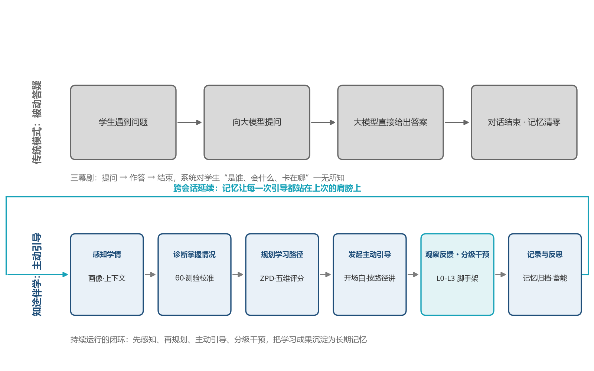
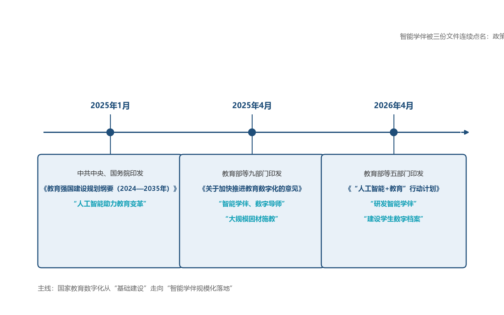
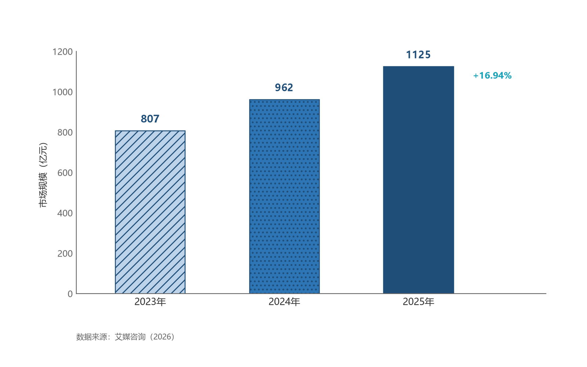
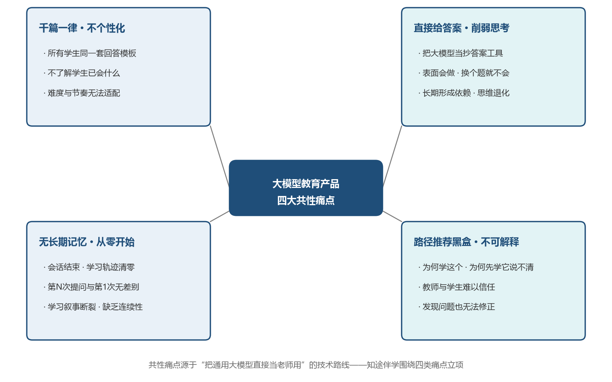
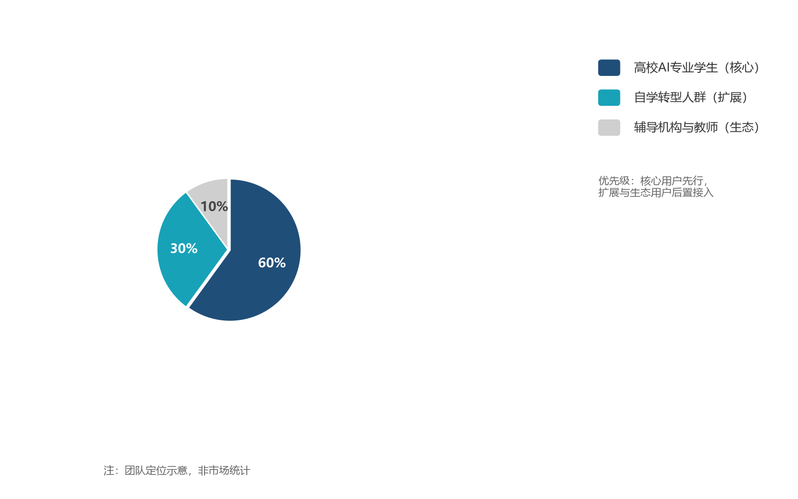

# 第1章 需求背景

## 1.1 命题解读：站在科大讯飞的视角看这道题

### 1.1.1 讯飞智慧教育生态与命题的产业位置

科大讯飞自 2004 年起布局智慧教育，以星火大模型为技术底座，构建了"G 端区域因材施教—B 端学校智慧课堂—C 端个人学习机"的完整业务体系。截至 2025 年 6 月，讯飞智慧教育产品已服务全国 32 个省级行政区、5 万余所学校、1.3 亿师生；截至 2026 年 6 月，进一步覆盖 33 个省级行政区、6 万余所学校、累计服务超 1.6 亿师生（数据来源见 1.6 节）。其中，智学网已在全国 3 万余所学校常态化应用、受益师生超 4500 万；星火教师助手服务教师超 80 万名、日均互动率达 75%。媒体对讯飞教育业务升级方向有一句精准概括："从'解题'到'伴学'"。

需要指出的是，现有星火教育产品体系主要解决"教的效率"——批阅、备课、组卷、讲评与区域治理。命题九十六要解决的是"学的深度"：一个既懂知识、又懂学生、还能持续陪伴的 AI 导师。这恰是讯飞生态从"工具层"向"伴学层"延伸的关键一步——AI 学习机需要更懂孩子的伴学策略，智学网的个性化学习手册需要可解释的路径决策，而高校人工智能人才培养场景，则需要一个能扎根课堂、可私有化部署、面向学生个体的伴学智能体。本命题在产业中的位置，就是讯飞"AI+教育"生态面向高等教育、面向学生个体深度陪伴的那块能力拼图。

命题原文进一步指出：个性化教育需求爆发，"千人一面"的教学模式难以满足多元化需求；知识图谱与推荐算法虽已应用多年，但缺乏灵活交互能力与深层推理能力；大模型智能体为构建"既懂知识又懂学生"的 AI 导师提供了可能；由此要求实现从"被动答疑"到"主动引导"的教育范式跃迁。这四句话依次点明了本命题的四个侧面：需求侧（大规模因材施教）、技术侧（知识图谱与推荐算法 × 大模型智能体的深度融合）、产品侧（AI 导师）与范式侧（主动引导）。知途伴学的全部设计，正是对这四句话的逐一应答。

### 1.1.2 命题内涵拆解与应答映射

**表1-1 命题要求与知途伴学应答设计对照表**

| 命题要求（命题原文要点） | 知途伴学的应答设计 |
| --- | --- |
| 大模型驱动 | 构建 OpenAI 兼容 LLM 抽象层，统一接入讯飞星火（spark-api-open.xf-yun.com，已实测联调）、DeepSeek 等大模型；无 API Key 时离线 Mock 运行，开发、演示、交付全程不中断 |
| 自适应学习路径决策 | 拓扑分层保证先修关系、ZPD 最近发展区匹配内容难度、节奏参数适配个体学习速度；每一步路径推荐均给出教育学上可解释的理由 |
| 伴学智能体 | "感知→规划→行动→记忆"智能体主循环 + 七态状态机（IDLE→DIAGNOSING→QUIZZING→TEACHING⇄INTERVENING→REFLECTING，另设 PRACTICING 自主练习态），实现会话内的主动引导与会话间的记忆延续 |
| 能力一：学情诊断 | 对话 + 测验双通道动态诊断，BKT 简化模型 + Elo 自适应学习率实时更新掌握度，构建并持续修正精准学生画像 |
| 能力二：路径规划 | 基于画像与 50 知识点知识图谱动态生成个性化学习路径，实现学习顺序、内容难度、学习节奏三项智能适配 |
| 能力三：实时干预 | 四级脚手架式辅导（苏格拉底反问→概念提示→类比样例→分步解析＋变式检验），只引导、不代答，培养独立解决问题能力 |
| 能力四：记忆与反思 | SQLite 9 表跨会话长期记忆 + 反思摘要 + 跨会话开场白延续，基于历史反思持续优化后续学习计划 |
| 范式跃迁：从"被动答疑"到"主动引导" | 系统主动发起诊断、引导、追问与复习提醒，而非被动等待学生提问 |

### 1.1.3 范式跃迁：从"被动答疑"到"主动引导"

传统大模型教育产品的运行逻辑是"三幕剧"：学生提问 → 大模型作答 → 对话结束，系统对学生"是谁、会什么、卡在哪"一无所知，下一次对话依然从零开始。而知途伴学把交互重构为一个持续运行的闭环：系统先感知学情、再规划路径、继而主动发起引导，观察学生的反应后决定干预力度，最后记录并反思本次会话，为下一次主动引导做准备，如图1-1所示。

这一跃迁也与国家政策方向逐字对应：教育部等九部门文件明确提出"通过智能学伴、数字导师探索人机协同教学新模式，实现人工智能驱动的大规模因材施教"（2025 年 4 月）；教育部等五部门《"人工智能+教育"行动计划》将"研发智能学伴""建设学生数字档案"列为赋能学生学习的第一任务（2026 年 4 月）。知途伴学不是在做一个"更会答题的模型"，而是在做一个"更会教人、更懂学生"的智能体。

## 1.2 政策环境：从"教育数字化"到"人工智能+教育"

本项目所处的政策环境可以用三份国家级文件勾勒出一条清晰的升级主线（如图1-2所示）：

- 《教育强国建设规划纲要（2024—2035 年）》（中共中央、国务院 2025 年 1 月印发）：将"建设学习型社会，以教育数字化开辟发展新赛道"列为重点任务，明确实施国家教育数字化战略、促进人工智能助力教育变革。
- 教育部等九部门《关于加快推进教育数字化的意见》（教办〔2025〕3 号，2025 年 4 月 16 日发布）：提出"加快建设人工智能教育大模型"，"通过智能学伴、数字导师探索人机协同教学新模式，实现人工智能驱动的大规模因材施教"，并要求"建立基于大数据和人工智能支持的教育评价机制……开展精准画像"。本项目的"伴学智能体 + 学生画像 + 个性化路径"三大要素与该文件的关键表述逐字对应。
- 教育部等五部门《"人工智能+教育"行动计划》（2026 年 4 月印发）：提出到 2030 年人工智能与教育深度融合格局基本形成；在"赋能学生学习"任务中部署"研发智能学伴、思政大模型，建设学生数字档案"；在高等教育领域推动人工智能成为高校公共基础课，并部署建设国家教育智能算力服务平台（教育智联网）与人工智能教育大模型。

结论是明确的：智能学伴与个性化学习不是可选项，而是国家教育数字化战略的既定路径。本项目方向的政策确定性高，属于"政策点名、企业出题、高校育人"三方交汇的赛道。

## 1.3 行业背景与市场

### 1.3.1 市场容量与增长趋势

从用户规模、市场规模与产业投入三个口径看，赛道处于高速扩张期：

**用户规模**：中国互联网络信息中心（CNNIC）第 57 次《中国互联网络发展状况统计报告》显示，截至 2025 年 12 月，我国在线教育用户规模达 3.27 亿人，刷新历史纪录。国家智慧教育公共服务平台累计注册用户突破 1.64 亿（2025 年 5 月《中国智慧教育白皮书》口径），汇集高等教育在线课程 3.1 万门——"课程资源极大丰富"与"个性化指导仍然稀缺"并存，正是伴学智能体的机会窗口。

**市场规模**：艾瑞咨询《2026 年中国 GenAI+ 教育行业发展报告》测算，2025 年中国 GenAI+ 教育产品服务总规模约 3442 亿元，年复合增长率约 37%，预计 2028 年达 8910 亿元，其中技术能力价值约 664 亿元；2025 年中国教育信息化数字化经费规模约 5515 亿元（校端市场）。艾媒咨询数据显示，中国教育智能硬件市场规模由 2023 年的 807 亿元增至 2024 年的 962 亿元，2025 年达 1125 亿元（同比增长 16.94%），行业进入全民渗透阶段，如图1-3所示。

上述数据全部来自公开权威报告，本团队坚持"每处数据有出处、查不到可靠数据就定性表述"的原则，绝不使用无法溯源的数字。

**表1-2 关键市场数据一览（逐条可溯源，详见 1.6 节来源清单）**

| 指标 | 数值 | 统计口径 | 来源与年份 |
| --- | --- | --- | --- |
| 在线教育用户规模 | 3.27 亿人 | 截至 2025 年 12 月 | CNNIC 第 57 次《中国互联网络发展状况统计报告》，2026 年 2 月发布 |
| 高等教育在学总规模 | 4846.00 万人 | 2024 年 | 教育部《2024 年全国教育事业发展统计公报》，2025 年 6 月发布 |
| GenAI+ 教育产品服务总规模 | 约 3442 亿元（CAGR 约 37%，2028 年预计 8910 亿元） | 2025 年 | 艾瑞咨询《2026 年中国 GenAI+ 教育行业发展报告》，2026 年 2 月 |
| 教育信息化数字化经费 | 约 5515 亿元（2028 年预计 6802 亿元） | 2025 年，校端市场 | 同上 |
| 教育智能硬件市场规模 | 807 亿元 → 962 亿元 → 1125 亿元（+16.94%） | 2023—2025 年 | 艾媒咨询《2025—2026 年中国智能平板学习机市场趋势研究报告》等，2026 年 |
| 国家智慧教育平台注册用户 | 突破 1.64 亿（浏览量超 613 亿） | 截至 2025 年 5 月 | 教育部《中国智慧教育白皮书》，2025 年 5 月 |
| 高等教育在线课程资源 | 3.1 万门 | 截至 2025 年 4 月 | 教育部新闻发布会，2025 年 4 月 16 日 |
| 开设人工智能本科专业高校数 | 621 所（占全国普通高校比例超 50%） | 截至 2025 年 | 全国高校人工智能与大数据创新联盟《2025 全国 621 所普通高校人工智能专业教育教学综合实力排行榜》，2025 年 6 月 |
| 科大讯飞智慧教育覆盖 | 5 万余所学校、1.3 亿师生 → 6 万余所学校、超 1.6 亿师生 | 2025 年 6 月 → 2026 年 6 月 | 科大讯飞官方披露 / 兴业证券研报 |
| 智学网覆盖 | 32 个省级行政区、3 万余所学校、受益师生超 4500 万 | 截至 2025 年 | 科大讯飞官网 |
| 星火教师助手服务教师 | 超 80 万名，日均互动率 75% | 截至 2025 年 9 月 | 《杭州日报》报道，2025 年 9 月 |

### 1.3.2 高校人工智能人才培养的"量"与"难"

**"量"**：截至 2025 年，全国已有 621 所普通高校备案人工智能本科专业，占全国普通高校比例超过 50%；教育部《2024 年全国教育事业发展统计公报》显示，2024 年高等教育在学总规模达 4846 万人、普通本科招生 489.97 万人。这意味着每年有数十万计的新生进入人工智能及相关专业学习，《机器学习》是其中绕不开的核心课程。

**"难"**：其一，《机器学习》课程是数学推导、算法理解与工程调参的三重门槛，抽象性强、知识点先修关系严密（如不会"梯度下降"则无法真正理解"反向传播"），自学与班课学习都容易"卡点失焦"；其二，大班教学（动辄百人以上）决定了教师无法为每名学生提供一对一的诊断与引导；其三，行业报告同时指出，人工智能专业"师资力量仍较欠缺"。供给端的结构性缺口，恰恰是"既懂知识又懂学生"的伴学智能体的用武之地——621 所高校、每所每届数百名学生，正是"大规模因材施教"最现实、最刚需的落地场景之一。

## 1.4 痛点分析：大模型教育产品的四大共性问题

当前市面上的大模型教育产品普遍存在四类共性问题，它们不是个别产品的缺陷，而是"把通用大模型直接当老师用"这一技术路线的系统性短板，全景如图1-4所示。知途伴学正是围绕这四类痛点立项的。

**痛点一：千篇一律，不个性化。** 绝大多数产品对所有学生使用同一套回答模板与学习资料，既不关心学生"已会什么、卡在哪里"，也不适配其节奏与基础。个性化教育需求已经爆发，供给却仍是"千人一面"。

**痛点二：直接给答案，削弱思考。** 大模型的强答能力被滥用为"抄答案工具"——学生问一题得答案、再问再得，看似高效，实则绕过了思考过程。"会做题"不等于"学会了"，直接给答案恰恰剥夺了学生独立解决问题的练习机会，违背了命题企业一贯强调的"培养自主学习能力"的产品理念。

**痛点三：无长期记忆，每次从头开始。** 通用对话产品会话结束即"失忆"：学生第五次问"梯度下降"与第一次问没有区别，系统不会记得他三周前在哪一章卡壳、上周测验错了哪类题。没有跨会话记忆，就谈不上"持续陪伴"，更谈不上基于历史反思优化学习计划。

**痛点四：路径推荐黑盒，不可解释。** 依赖隐式推荐算法的"下一步学什么"缺少教育学依据，学生与教师既看不懂推荐理由，也无法干预修正。在教育场景中，不可解释意味着不可信任、不可交付——这恰恰是命题原文所指"知识图谱与推荐算法缺乏灵活交互与深层推理能力"的症结。

**表1-3 痛点—根因—知途对策映射表**

| 痛点 | 典型表现 | 根因 | 知途伴学的对策 |
| --- | --- | --- | --- |
| 千篇一律不个性化 | 所有人同一套回答、同一份资料 | 没有学生画像，系统"不认识"学生 | 学情诊断引擎构建并持续更新学生画像，一切输出以画像为前提 |
| 直接给答案削弱思考 | 学生依赖大模型抄答案，学习效果差 | 产品目标错位：追求"答得快"而非"学得会" | 四级脚手架干预，只引导不代答，苏格拉底式反问优先 |
| 无长期记忆从头开始 | 每次对话都从零开始，无连续性 | 会话级存储，缺少记忆与反思机制 | SQLite 9 表长期记忆 + 反思摘要 + 跨会话开场白延续 |
| 路径推荐黑盒不可解释 | 推荐理由不明，师生无法信任与修正 | 隐式推荐算法，缺少教育学约束 | BKT+Elo 掌握度公式、拓扑分层 + ZPD + 节奏参数，每步推荐给出可解释理由 |

## 1.5 目标用户画像

知途伴学采用"核心用户—扩展用户—生态用户"三圈结构（如图1-5所示），首期聚焦最刚需、最易验证的核心场景：

- **核心用户（主）**：高校人工智能及相关专业学生。正在修读或备考《机器学习》课程，需要个性化学习路径、可解释的诊断反馈与"有人带着学"的结构化引导。该群体基数明确（621 所高校开设人工智能专业），痛点刚性（课程难、大班教学无法一对一），且与命题企业的星火教育生态天然衔接。
- **扩展用户**：自学转型人群。包括在职工程师转型 AI、跨专业考研/保研学生、以及有学习需求的社会学习者。他们缺乏课程组织与路径规划能力，对"主动引导"的需求比在校生更强。
- **生态用户（次）**：辅导机构与高校教师。将伴学智能体作为教研辅助与课后辅导工具，承接大量重复性答疑与个性化巩固训练，实现"教师减负、学生增效"。

**表1-4 目标用户画像表**

| 用户群 | 典型场景 | 核心诉求 | 关键痛点 | 定位与优先级 |
| --- | --- | --- | --- | --- |
| 高校 AI 及相关专业学生 | 修读《机器学习》课程、期末备考、课程设计补基础 | 个性化路径、可解释反馈、随时可问且记得住"我" | 课程难、大班无一对一、AI 答疑只会给答案 | 核心用户（主） |
| 自学转型人群 | 在职转型 AI、跨考学生、社会学习者 | 结构化路径规划、主动引导、进度延续 | 无老师带、路径混乱、易半途而废 | 扩展用户 |
| 辅导机构与高校教师 | 课后辅导、答疑分流、学情摸底 | 减轻重复答疑、批量掌握学情、可解释的推荐理由 | 一人对百人、学情数据碎片化、黑盒工具不敢用 | 生态用户（次） |

## 1.6 本章数据来源清单

1. 中共中央、国务院《教育强国建设规划纲要（2024—2035 年）》（2025 年 1 月）：http://www.moe.gov.cn/jyb_xwfb/xw_zt/moe_357/2025/2025_zt02/；http://politics.people.com.cn/n1/2025/0120/c1001-40404961.html
2. 教育部等九部门《关于加快推进教育数字化的意见》（教办〔2025〕3 号，2025 年 4 月）：http://www.moe.gov.cn/srcsite/A01/s7048/202504/t20250416_1187476.html
3. 教育部等五部门《"人工智能+教育"行动计划》（2026 年 4 月）：http://news.china.com.cn/2026-04/10/content_118429322.shtml
4. CNNIC 第 57 次《中国互联网络发展状况统计报告》相关报道（2026 年 2 月）：https://www.eol.cn/news/yaowen/202602/t20260206_2718746.shtml
5. 艾瑞咨询《2026 年中国 GenAI+ 教育行业发展报告》（2026 年 2 月）：https://www.sgpjbg.com/labelsyh/genaijiaoyushichangguimo/1/6778818.html；http://m.hibor.net/wap_detail.aspx?id=2ee5c58df0a0a8e9a5f05f423eb3cd97
6. 艾媒咨询教育智能硬件市场规模（2026 年发布）：https://www.iimedia.cn/c1086/115182.html；https://www.iimedia.cn/c400/115130.html
7. 教育部《2024 年全国教育事业发展统计公报》（2025 年 6 月）：https://www.cernet.edu.cn/rd/gao_xiao_cheng_guo/gao_xiao_zi_xun/202506/t20250611_2674072.shtml
8. 国家智慧教育公共服务平台数据（2025 年 4 月发布会）：https://edu.cnr.cn/dj/20250416/t20250416_527136948.shtml；https://app.www.gov.cn/govdata/gov/202504/17/526983/article.html
9. 621 所高校人工智能专业备案数据（2025 年 6 月）：http://paper.chinahightech.com/pc/content/202506/16/content_152006.html
10. 科大讯飞智慧教育覆盖数据（2025—2026 年）：https://www.wenweipo.com/a/202506/25/AP685b70cce4b038f05d24d5ae.html；https://www.sgpjbg.com/labelsyh/xinghuodamoxingjiaoyuyingyong.html；智学网：https://edu.iflytek.com/about-us/news/regional-consultation/181；"从'解题'到'伴学'"：https://www.yangtse.com/news/txs/202505/t20250529_213827.html；星火教师助手：https://mdaily.hangzhou.com.cn/hzrb/2025/09/30/article_detail_1_20250930A1413.html
