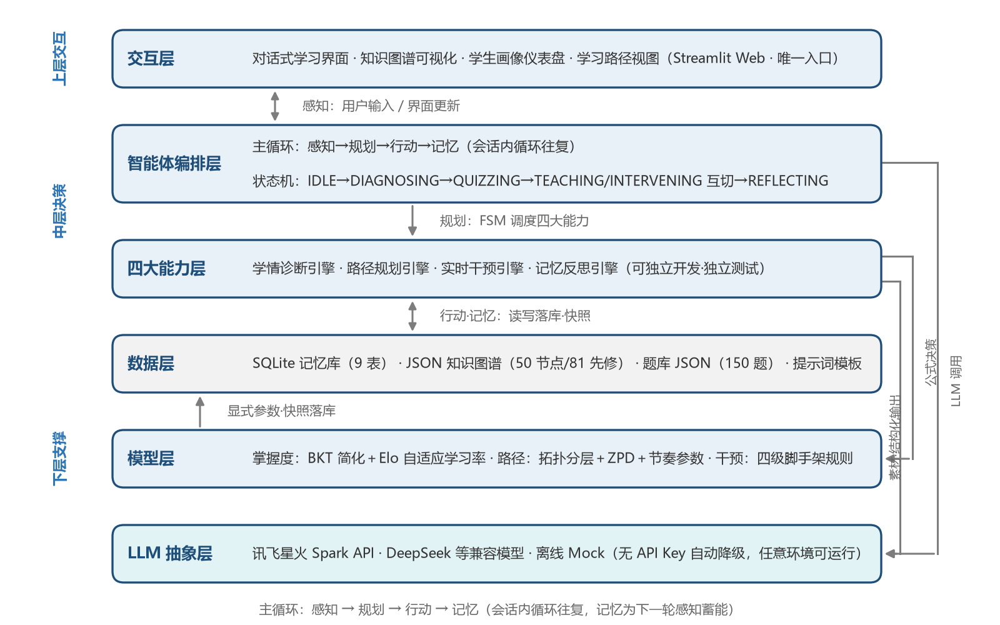
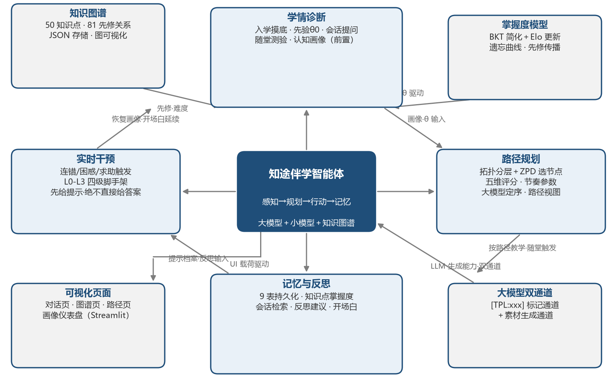
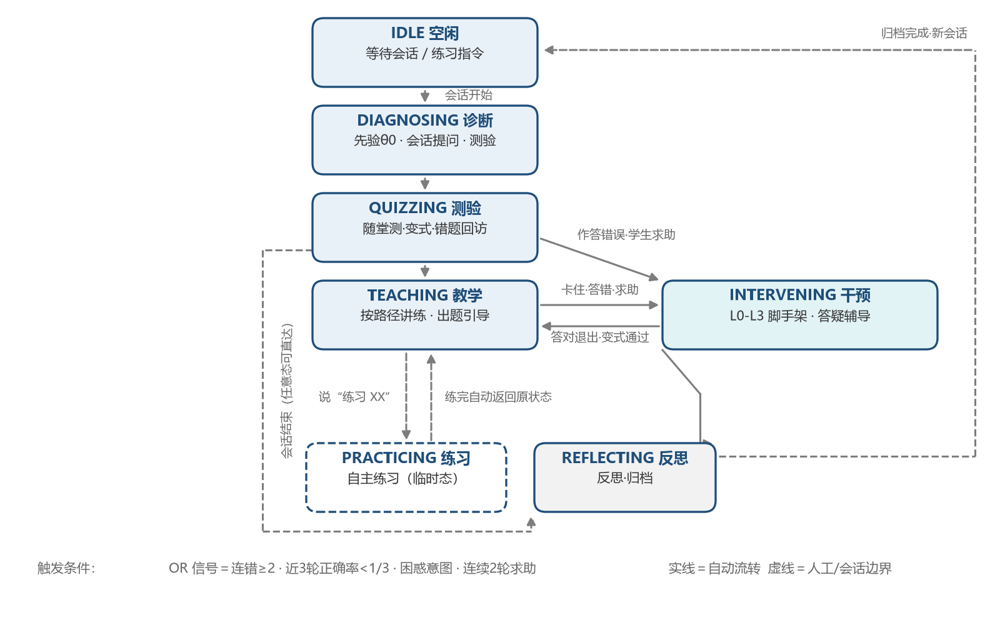
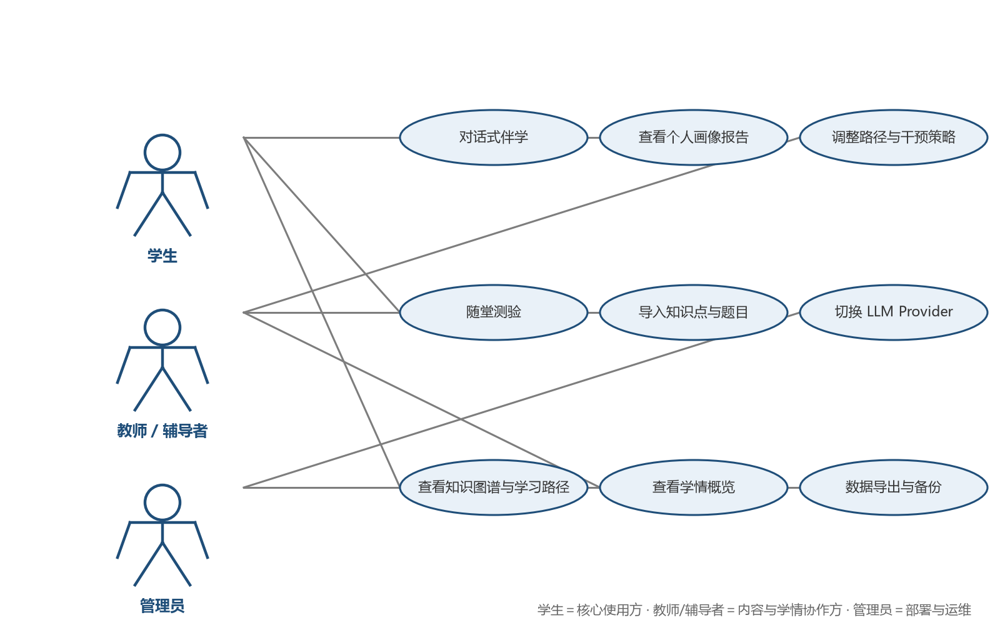
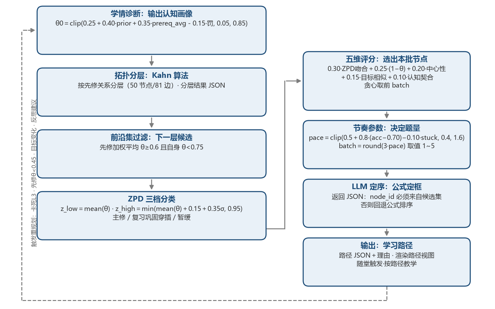
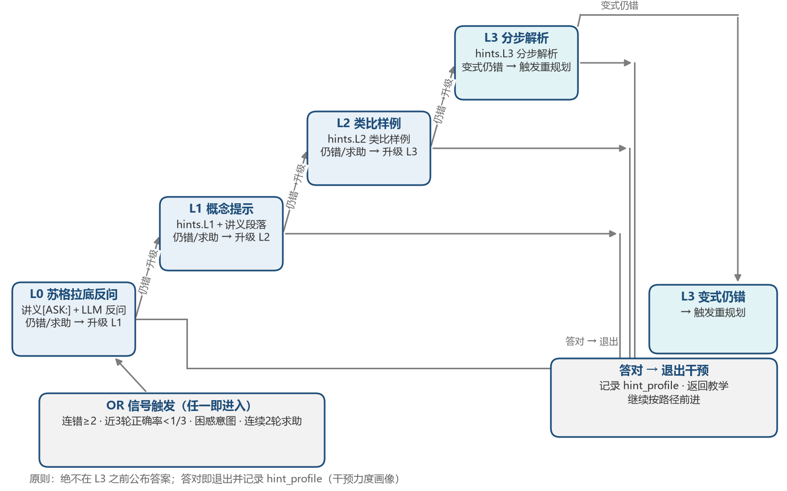
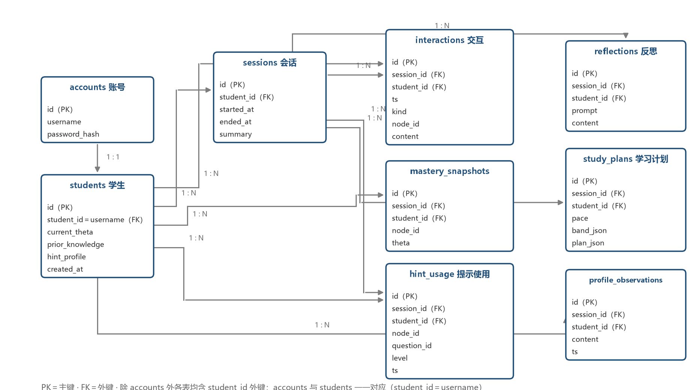

# 第2章 平台设计

本章给出系统的平台设计：先讲定位、架构、模块、流程、用例与技术选型（总体设计），
再展开知识图谱、掌握度模型、路径规划、学情诊断、脚手架干预、记忆与反思、大模型
抽象层与状态机的详细设计。所有公式与参数均可溯源到源代码（src/ 目录），体现了
"可解释 AI 教育"的设计主张。

## 2.1 系统定位与设计原则

**系统定位**：知途伴学不是"又一个通用 AI 问答"，而是一门课的伴学智能体——垂直聚焦《机器学习》课程，以大模型提供交互与生成能力，以显式的教育学模型提供决策与解释能力，形成"大模型 + 小模型（规则/公式）+ 知识图谱"的混合架构。系统遵循五条设计原则：

1. **教育正确性优先**——教学策略（脚手架、最近发展区、苏格拉底式提问）优先于模型能力，宁可"少说一句"也不"代答一步"；
2. **可解释、可信任**——掌握度、路径、干预级别全部由显式公式与规则给出，每一步决策可追溯、可复核、可修正；
3. **垂直深耕**——以 50 知识点知识图谱把《机器学习》一门课做深做透，先证明单点价值，再谈横向复制；
4. **轻量、可私有化**——全栈免费开源组件，无 GPU、无 API Key 即可运行，数据全本地存储，满足校园场景的合规与成本约束；
5. **可迁移、可扩展**——知识图谱可替换为其他课程，LLM Provider 一行配置即可切换，具备向讯飞星火生态对齐的接口能力。

**表2-1 设计原则与落地机制对照表**

| 设计原则 | 含义 | 落地机制 | 对应能力模块 |
| --- | --- | --- | --- |
| 教育正确性优先 | 引导而非代答，培养独立解题能力 | 四级脚手架干预规则、ZPD 难度匹配 | 实时干预 |
| 可解释可信任 | 决策过程白盒化 | BKT 简化 + Elo 公式、拓扑分层与节奏参数显式输出 | 学情诊断、路径规划 |
| 垂直深耕 | 一门课做到极致 | 50 知识点 · 81 先修关系的《机器学习》知识图谱 | 知识图谱可视化 |
| 轻量可私有化 | 零成本运行、数据不出校 | Python/Streamlit/SQLite 全开源栈、离线 Mock | 数据层、LLM 抽象层 |
| 可迁移可扩展 | 换课程、换模型不改架构 | JSON 知识图谱热替换、OpenAI 兼容 Provider 切换 | 总体架构 |

**学术与工程依据**：本设计并非凭空而来，而是建立在对国内外开源前沿工作的系统调研之上。香港大学数据智能实验室（HKUDS）开源的 DeepTutor 是"Agent 原生个性化学习助手"的代表作，其"多智能体编排 + 三层记忆（摘要/画像/交互轨迹）+ 统一学习者画像"的架构，验证了"感知—规划—行动—记忆"路线的可行性；华东师范大学 ECNU-ICALK 团队开源的 EduChat 开创了教育大模型先河，其苏格拉底式启发教学与"先思考、后教学"的范式，直接启发了本项目的四级脚手架设计；经典教材《动手学深度学习》d2l-zh 则为《机器学习》知识体系的组织提供了权威参照。同时，BKT（贝叶斯知识追踪）与 Elo 评级模型是教育数据挖掘领域数十年积累的成熟方法，ZPD 最近发展区源于维果茨基的经典教育学理论。知途伴学的贡献在于：把上述学术共识在"零成本、可私有化"的工程约束下整合为一套可演示、可解释的完整系统（借鉴—改进对照详见附录 B）。

## 2.2 总体架构

系统采用六层架构，自顶向下为交互层、智能体编排层、四大能力层、数据层、模型层与 LLM 抽象层，如图2-1所示。"上层交互、中层决策、下层支撑"：编排层负责"何时说"，能力层负责"说什么、怎么说"，模型层与数据层负责"凭什么这么说"，LLM 抽象层负责"用什么模型说"。



- **交互层**：Streamlit Web 界面，提供对话式学习、知识图谱可视化、学生画像仪表盘与学习路径视图，是系统唯一的用户入口；
- **智能体编排层**：实现"感知→规划→行动→记忆"主循环与七态状态机，按状态调度四大能力，是全系统的"大脑"；
- **四大能力层**：学情诊断引擎、路径规划引擎、实时干预引擎、记忆反思引擎，对应命题四大核心能力，可独立开发、独立测试；
- **数据层**：SQLite 数据库（账户、学生、会话、交互、掌握度、路径、干预、反思、画像观察 9 张表）与 JSON 知识图谱（50 知识点、81 条先修关系），全部本地存储；
- **模型层**：BKT 简化 + Elo 自适应学习率掌握度模型、拓扑分层 + ZPD + 节奏参数路径模型、四级脚手架干预规则，全部为可解释的显式算法；
- **LLM 抽象层**：OpenAI 兼容统一接口，Provider 可切换为讯飞星火、DeepSeek 等，无 API Key 时降级为离线 Mock，保证系统在任意环境下可运行。

## 2.3 核心功能模块

系统由六大功能模块构成：命题要求的四大能力模块，加上面向师生两端的两大可视化模块，如图2-2所示。可视化不是装饰，而是"可解释"承诺的产品化兑现——学生能看懂自己会什么、该学什么、为什么这样学；教师能看懂系统凭什么这样判断。



- **学情诊断**：对话与测验双通道采集学情，用 BKT 简化 + Elo 自适应学习率实时更新掌握度，输出结构化学生画像，作为其余一切决策的输入；
- **路径规划**：先按知识图谱拓扑分层保证先修关系，再以 ZPD 最近发展区匹配难度区间，最后以节奏参数适配个体速度，动态生成个性化学习路径；
- **实时干预**：当学生在测验或问答中出错时，按四级脚手架逐级升级引导（反问→提示→样例→解析），仅在必要层级给出支撑，最后以变式检验确认"真学会"；
- **记忆与反思**：9 表存储跨会话轨迹，会话结束生成反思摘要，下次会话以"接着上次"的开场白延续，实现学习叙事的连贯性；
- **知识图谱可视化**：全局拓扑展示 50 知识点与 81 条先修关系，以颜色标注掌握状态、高亮推荐路径，让学生"看见自己的学习地图"；
- **学生画像可视化**：以仪表盘形式呈现掌握度、能力维度与行为统计，让诊断结果可读、可核、可信。

## 2.4 系统工作流程

**主循环（感知→规划→行动→记忆）**：系统遵循智能体标准主循环运转。会话开始时先"感知"——读取学生画像与上次会话的反思摘要，快速恢复上下文；随后"规划"——决定当前需要诊断、教学、测验还是干预，并生成相应计划；继而"行动"——执行讲解、提问或脚手架引导；最后"记忆"——落库本次交互、更新掌握度、生成反思摘要，为下一轮循环蓄能。四步循环往复，正是"主动引导"区别于"被动答疑"的机制根源。

**状态机**：在会话内部，系统以七态状态机组织交互节奏（如图2-3所示）——IDLE（等待）→ DIAGNOSING（诊断）→ QUIZZING（测验）→ TEACHING（教学）⇄ INTERVENING（干预）→ REFLECTING（反思），另有 PRACTICING（自主练习）态供学生随时选题练习、练完自动返回原状态。状态机保证了教学过程的结构化：先诊断后教学、教学后必巩固、出错必干预、会话结束必反思，避免"问什么答什么"的无序闲聊。



以一次典型学习会话为例：学生登录后，系统以"接着上次"的开场白延续进度（记忆）→ 对上次薄弱知识点做快速诊断（DIAGNOSING）→ 生成并讲解下一个知识单元（TEACHING）→ 随堂测验巩固（QUIZZING）→ 学生答错时进入四级脚手架引导，答对后追问变式检验"是否真会"（INTERVENING）→ 会话结束生成反思摘要并归档（REFLECTING）→ 回到 IDLE 等待下一次主动唤醒。整个过程无需学生"知道该问什么"，系统始终比他更清楚"下一步该学什么"。

## 2.5 系统用例

系统面向三类角色：学生是核心使用者，与系统进行伴学互动并查看各类可视化成果；教师/辅导者负责内容供给与策略监督，体现"人机协同、教师在环"的原则；管理员负责系统运行配置与数据管理，用例图如图2-4所示。



## 2.6 技术选型与理由

技术选型遵循三条铁律：免费（学生团队可承担）、离线可跑（演示与交付不依赖网络与付费 API）、轻量可私有化（满足校园数据合规与校内部署要求）。逐项对照如下：

**表2-2 技术选型对照表**

| 组件 | 选型 | 在系统中的作用 | 选择理由 |
| --- | --- | --- | --- |
| 开发语言 | Python 3 | 全系统逻辑实现 | 免费开源，AI/教育研究工具链同源，团队成员熟练 |
| 界面框架 | Streamlit | 交互层全部界面 | 纯 Python、零前端成本，数小时即可产出可交互原型，适合快速迭代 |
| 数据库 | SQLite（9 表，WAL 模式） | 长期记忆与全部业务数据 | 零安装零运维、单文件可备份迁移、天然适配单机私有化 |
| 知识图谱 | 手写 JSON（50 节点 · 81 边） | 课程知识结构 | 免图数据库运维成本，结构人工可审核、可修订，保证教学正确性 |
| 掌握度/路径模型 | 显式规则与公式（BKT 简化、Elo、ZPD、拓扑分层） | 模型层决策 | 可解释、可单元测试、无训练成本，避免黑盒模型的教育风险 |
| LLM 接入 | OpenAI 兼容抽象层 | 大模型能力接入 | 一行配置切换星火 / DeepSeek / Mock，不锁定单一供应商，无 API Key 也能全流程演示 |
| 测试体系 | pytest + conftest 配置 | 质量保障 | 离线可回归测试，保证 Mock 模式下四大能力全流程可验证 |

**与命题企业的技术衔接**：科大讯飞星火开放平台提供 OpenAI 兼容 API（spark-api-open.xf-yun.com），本项目的 LLM 抽象层可一行配置切换至星火（本项目已开通星火 Lite 永久免费额度并实测联调通过，见 5.7 节），实现"学生团队开发验证 → 星火正式环境交付"的平滑过渡；同时，"可解释小模型（BKT/Elo/规则）+ 大模型（生成与交互）"的混合架构，正是讯飞"教育大模型 + 知识图谱"技术路线在轻量场景下的工程化验证，具备成为讯飞教育生态中可私有化轻量组件的潜力。部署形态上，系统以 pip install 依赖 + 本地运行的方式交付，可打包为校内服务器或私有云部署，全部学习数据不出校，符合教育数据安全与伦理要求。

## 2.7 知识图谱与知识库设计

知识库是本系统的学科内容底座，由三部分构成：知识图谱（结构）、题库（诊断与干预素材）、分段讲义（教学内容）。三者以节点 ID 对齐，构成"结构—诊断—教学"闭环数据资产。

### 2.7.1 知识图谱节点设计

选择人工智能专业《机器学习》课程为学科载体，覆盖从数学基础到深度学习的完整学习链路。每个节点是一个知识点，字段设计如表2-3所示。

**表2-3 知识图谱节点字段设计**

| 字段 | 类型 | 说明 |
|---|---|---|
| id | string | 节点唯一标识（如 d02），题库与讲义以此为锚 |
| name | string | 知识点名称（如「反向传播算法」） |
| category | string | 所属类别（7 类之一） |
| difficulty | float | 难度系数 0~1，由知识点在课程中的认知要求标定 |
| bloom | int | 布鲁姆认知层次 1~6（记忆→创造），指导题型与脚手架设计 |
| objectives | list | 学习目标列表，用于讲义与测验的目标对齐 |
| minutes | int | 建议学习时长（分钟），用于节奏规划参考 |
| summary | string | 知识点摘要，用于画像页与路径页展示 |
| lecture | string | 分段讲义（Markdown），内嵌 [ASK:] 提问位 |
| keywords | list | 关键词列表，用于记忆检索与目标匹配 |

50 个节点按学习认知顺序分布在 7 个类别中，分布如表2-4所示。

**表2-4 知识点类别分布**

| 类别 | 节点 ID 范围 | 数量 | 难度区间 | 定位 |
|---|---|---|---|---|
| 数学基础 | m01–m08 | 8 | 0.25–0.50 | 学习 ML 的前置底座 |
| ML 概论 | b01–b04 | 4 | 0.25–0.40 | 概念框架与评估视角 |
| 经典监督学习 | s01–s12 | 12 | 0.30–0.55 | 算法主体 |
| 集成学习 | e01–e05 | 5 | 0.45–0.60 | 提升技巧 |
| 神经网络深度学习 | d01–d12 | 12 | 0.45–0.65 | 进阶主线 |
| 评估调优 | v01–v06 | 6 | 0.40–0.50 | 工程方法论 |
| 无监督学习 | u01–u03 | 3 | 0.45–0.50 | 拓展分支 |

（完整 50 知识点清单见附录 A。）

### 2.7.2 知识图谱边设计

边描述知识点间的依赖关系，字段设计如表2-5所示。

**表2-5 知识图谱边字段设计**

| 字段 | 类型 | 说明 |
|---|---|---|
| source | string | 前置知识点 ID |
| target | string | 后继知识点 ID |
| type | string | prerequisite（先修，参与路径规划）或 related（相关，仅可视化） |
| weight | float | 关系权重，用于先修达标计算的加权平均 |

两条设计原则：

1. **先修图必须无环**：系统启动时执行 Kahn 拓扑排序校验，若存在环立即报错拒绝启动（对应测试用例 T-KG-02 自动验证）；
2. **先修边决定"可学性"**：某节点的先修节点加权平均掌握度 ≥ 0.6 时，该节点才进入候选前沿集——这是"没学会走不教跑"的结构性保证。

自适应测验主链（MAIN_CHAIN）从图中抽取一条"机器学习学习主脉络"：

```
b01 机器学习基本概念 → s02 线性回归 → s03 逻辑回归 → e01 集成学习思想
→ e04 GBDT 与 XGBoost → d01 多层感知机 → d02 反向传播算法 → d08 Transformer
```

### 2.7.3 题库设计

题库共 150 题（平均每节点 3 题），每题字段设计如表2-6所示。题库与图谱双向对齐（构建脚本校验：题库不引用不存在的节点、每个节点至少 2 题、每题 ID 唯一）。

**表2-6 题库题目字段设计**

| 字段 | 说明 |
|---|---|
| id / node_id | 题目 ID 与所属知识点 |
| stem / options / answer | 题干、选项、正确答案 |
| difficulty | 题目难度，与知识点难度协同用于测验选题 |
| explanation | 解析（学生答完即见，含知识点依据） |
| hints | L0~L3 四级提示（脚手架干预的素材锚点，见 2.11） |
| variant | 变式题（同知识点、换表述与数据），用于 L3 后检验"真理解" |

### 2.7.4 分段讲义设计

每节点讲义按教学逻辑分段，段内可内嵌 [ASK:] 提问位。设计意图有二：

1. **进度可控**：伴学智能体按段推进教学（"这一部分讲到这里"），学生的每次回应既是理解信号（软证据 c=0.5 更新掌握度），也是推进下一段的确认；
2. **苏格拉底式兜底**：[ASK:] 提问位是 Socratic 反问的天然素材——学生卡住时，系统回退到最近的提问位用"引导式提问"而非直接公布答案（与 EduChat 的启发式教学理念一致，见附录 B 借鉴—改进对照）。

## 2.8 掌握度模型设计

掌握度 θ_k∈[0,1] 表示学生对知识点 k 的掌握程度，是全系统的数值核心：诊断报告、路径评分、ZPD 带、脚手架升级全部由它驱动。模型融合了知识追踪（BKT）与自适应学习率（Elo）思想，并扩展了先修传播与遗忘衰减两个教育学机制。

### 2.8.1 初始化

新学生完成对话诊断后，结合先验与图结构初始化：

[F] θ_k⁰ = clip( 0.25 + 0.40·prior_k + 0.35·prereq_avg(k) − 0.15·I[∃先修节点 θ<0.6], 0.05, 0.85 )

- prior_k ∈ {0, 0.5, 1.0}：对话诊断提取的先验（"学过线性代数"→ 相关节点 prior=1.0，"学过一点"→0.5）；
- prereq_avg(k)：节点 k 所有先修节点的 θ 均值——先修好，后继自然有基础；
- 惩罚项：若任一先修 θ<0.6，说明 k 的根基不牢，初始掌握度下调 0.15；
- 边界裁剪 [0.05, 0.85]：避免"全知"与"全盲"两个病态端点（保留学习空间）。

### 2.8.2 更新（作答反馈）

每次作答后更新（BKT 简化 + Elo 自适应学习率）：

[F] p = sigmoid( 8·(θ−0.5) )  （预测答对概率）
[F] θ' = θ + K·(c − p)  （c：实际结果，对=1/错=0）
[F] K = K_base · (1 − n/(n+3))  （学习率随该节点作答次数 n 衰减）

- K_base = 0.18（测验证据，强信号）；K_base = 0.09（对话软证据，弱信号，c∈{0, 0.5, 1}）；
- 学习率衰减的意义：初学者每一次反馈信息量大（大步调整），随着作答次数增加，掌握度估计趋于稳定（小幅微调）——这是 Elo 评级在棋类系统中被验证的自适应思想；
- 单调性有保证（答对必升、答错必降），测试用例 T-MA-04 等 10 项覆盖本模型全部行为（见第4章）。

### 2.8.3 遗忘衰减与先修传播

跨会话间隔 Δt 天后，所有节点掌握度按遗忘曲线衰减（仅对 θ>0.5 的节点生效，避免"已会者遗忘"与"未会者无谓衰减"混杂）：

[F] θ ← θ · exp(−0.02·Δt)

参数取值参考艾宾浩斯遗忘曲线的早期形态，衰减幅度温和（30 天约衰减 45%）。

先修传播实现结构联动：

- **答对后继节点**：其所有先修节点 θ += 0.05（"会用梯度下降，说明导数也还行"）；
- **答错节点**：其所有先修节点 θ −= 0.03 并加入 needs_review 复习集合（"反向传播算不对，可能是链式法则没吃透"——为 2.9.6 的动态重规划提供依据）。

### 2.8.4 可解释性设计

所有参数（0.40/0.35/0.15、K_base、衰减系数 0.02 等）均为显式常量，集中于 src/student/update.py。任一次掌握度变化都可回答"为什么变了、变了多少"——这是本项目区别于黑盒知识追踪的关键主张（详见 5.1.2 节）。

## 2.9 路径规划算法设计

路径规划回答"接下来学什么、按什么顺序、什么节奏"。算法分四步，流程如图2-5所示。



### 2.9.1 拓扑分层与前沿集

Kahn 算法对先修图拓扑分层。前沿集 = 先修加权平均掌握度 ≥ 0.6 且自身 θ < 0.75 的节点（先修达标＝可学，未掌握＝值得学）。

### 2.9.2 ZPD 最近发展区难度带

基于维果茨基最近发展区理论，把"跳一跳够得着"的难度区间量化：

[F] z_low = mean(θ)  （全节点掌握度均值）
[F] z_high = min( mean(θ) + 0.15 + 0.35σ, 0.95 )

前沿集节点按难度落带分档：

**表2-7 ZPD 难度带分档**

| 档位 | 条件 | 处理 |
|---|---|---|
| ZPD 主修 | z_low ≤ difficulty ≤ z_high | 优先纳入本批计划 |
| 复习巩固 | difficulty < z_low | 作为前置补漏穿插（难度低于当前水平，快速过关） |
| 暂缓 | difficulty > z_high | 暂不安排（超出最近发展区，学了也白学） |

### 2.9.3 候选评分与批次选择

[F] score = 0.30·ZPD吻合度 + 0.25·(1−θ) + 0.20·中心性 + 0.15·目标相似度 + 0.10·认知契合

- ZPD 吻合度 = 1 − |difficulty − z_center|：优先"难度刚刚好"的节点；
- (1−θ)：优先薄弱点；
- 中心性：节点的度中心性，优先"枢纽"知识点（学会一个带动一片）；
- 目标相似度：节点关键词与学生目标关键词的匹配（"想学深度学习"→ d 类加权）；
- 认知契合 = 1 − |bloom − (当前认知层级+1)|/5：优先略高于当前布鲁姆认知层级的知识点（最近发展区的认知维度）。

按评分贪心取前 batch 个，同时保证拓扑序（先修在前）。

### 2.9.4 节奏参数（动态难度适配）

[F] pace = clip( 0.5 + 0.8·(accuracy − 0.70) − 0.10·stuck_count, 0.4, 1.6 )
[F] batch = round( 3·pace )

- 测验正确率 70% 为基准线：高于 70% 学有余力，加快节奏（批次加大）；
- 卡住次数（stuck_count）越多，节奏越缓（宁可少学，不可学崩）；
- batch 取值 1~5：卡住的学生一次只学一个知识点，优秀的学生一次规划五个。

### 2.9.5 LLM 定序（大模型驱动的路径决策）

公式完成候选筛选后，最终学习顺序由大模型决定——这是命题"大模型驱动的自适应学习路径决策"的核心落点。LLM 读入学情统计（掌握度分布、ZPD 带、正确率、已完成节点）与候选清单（含各节点难度/掌握度/评分/档位），输出结构化 JSON：

```
{"items": [{"node_id": "候选节点", "reason": "面向学生的推荐理由"}],
 "notes": "整体安排说明"}
```

分工原则是公式定框、大模型定序：

- 公式（2.9.1~2.9.3）保证科学底线：候选先修达标、难度落带、评分可解释；
- 大模型在候选集内结合学情整体权衡（薄弱先修回补、目标关联、由易到难），给出最终顺序与逐条理由——把"为什么现在学这个"用学生听得懂的话讲出来；
- 校验兜底：node_id 必须来自候选集，非法输出整体回退公式结果，调用失败/离线 Mock 模式下自动降级，路径永不失效。

路径页展示当前计划的决策引擎标记（AI 大模型定序 / 可解释公式兜底）与整体安排说明，评委可现场验证大模型在路径决策中的真实参与。

### 2.9.6 LLM 动态重规划

静态规划无法预见学习过程中的意外（卡死、目标变化、先修崩塌）。重规划触发条件：

1. 脚手架升级到 L3 且变式检验仍错（卡死）；
2. 某先修节点 θ 跌破 0.45（先修崩塌）；
3. 学生主动表达目标变化（goal_change）；
4. 反思摘要输出调整建议。

重规划请求发送给 LLM，要求输出结构化 JSON：

```
{"action": "continue|review_prereq|reorder|lower_difficulty|insert_remediation",
 "node_id": "目标节点", "reason": "可解释原因", "new_order": ["可选的新顺序"]}
```

Mock 离线模式下由 replan_rules 规则兜底（选当前节点最弱的先修节点回补），真实 LLM 模式下由大模型结合学情统计给出更细腻的决策。两种模式输出同一 JSON 契约（见 2.13 双通道设计）。

## 2.10 学情诊断设计

诊断 = 对话背景采集 + 自适应测验，输出画像与诊断报告，作为路径规划的直接输入。

### 2.10.1 对话式背景诊断（四问）

开场后依次询问：①称呼 → ②学校与专业 → ③数学与机器学习基础 → ④学习目标。每一问通过规则引擎解析出结构化字段：

- 先验解析（_parse_prior）：命中「线性代数」→ m01/m02 prior=1.0；「高数/微积分」→ m03；「概率/统计」→ m04/m05；「学过一点」等程度词降为 0.5；「零基础」→ 全部 0；
- 目标解析（_parse_goals）：目标词映射为图谱节点关键词集——「深度学习」→ 多层感知机/反向传播/激活函数/卷积/池化/RNN/LSTM/Transformer/自注意力/GAN/词嵌入/预训练/微调/大模型 等 14 个节点关键词，直接驱动 2.9.3 的目标相似度项。

**大模型提取（真实模式双保险）**：第②问（先验+风格标签）与第③问（目标）先由大模型按 JSON 模板提取（_extract_prior_llm / _extract_goals_llm，模板 TPL:diag_extract），提取结果经图谱节点校验（非法节点丢弃、强度限幅 0~1、空标签过滤）后写入画像；解析失败或离线 Mock 模式自动回退上述规则引擎，诊断流程永不中断。

### 2.10.2 自适应测验（主链双向搜索）

测验沿 2.7.2 的主链做双向搜索，用最少的题目定位学生水平边界：

1. 从主链起点 b01 出题；
2. 答对 → 沿主链上跳（考更难的后继），水平边界上移；
3. 答错 → 下钻该节点的未覆盖先修（定位薄弱根源）；
4. 终止条件（满足任一）：已覆盖主链节点 ≥ 6；已作答 ≥ 12 题；最近 4 题对错交替（水平边界震荡收敛）；题库耗尽。

测验逐题实时更新掌握度（2.8.2），结束后生成诊断报告：掌握较好节点、薄弱节点、ZPD 带、建议起点、答题正确率。报告直接作为 PathPlanner.plan 的输入，形成"诊断→规划"闭环。测验逻辑由 test_diagnosis.py 5 项用例验证（含不重复出题、题目数上限、双向导航）。

## 2.11 脚手架干预设计（实时干预）

命题要求"脚手架式辅导而非直接给答案"。本系统将脚手架显式化为 L0~L3 四级阶梯（如图2-6所示），由 tutor/scaffold.py 实现，素材锚定在题库 hints 字段上（防幻觉）。



### 2.11.1 卡住判定（OR 信号）

**表2-8 卡住判定信号**

| 信号 | 阈值 |
|---|---|
| 连错次数 | ≥ 2 |
| 近 3 轮正确率 | < 1/3 |
| 困惑意图/词典 | 意图=confusion 或命中「不会/不懂/太难」等词 |
| 连续求助 | 连续 2 轮求助（"提示我一下"） |

命中任一信号即进入干预，无需等待学生主动求助。

### 2.11.2 四级阶梯

**表2-9 四级脚手架阶梯明细**

| 级别 | 形式 | 素材来源 | 升级条件 |
|---|---|---|---|
| L0 苏格拉底反问 | 引导式提问，不碰答案 | 讲义 [ASK:] 提问位 + LLM 生成（Mock 用提问位兜底） | 提示后仍错/求助 |
| L1 概念提示 | 指向讲义对应段落的概念锚点 | 题库 hints.L1 + 讲义段落定位 | 仍错/求助 |
| L2 类比样例 | 同类题完整求解过程 | 题库 hints.L2（解析/类比） | 仍错/求助 |
| L3 分步解析 | 逐步拆解 + 变式题检验 | 题库 hints.L3 + variant 变式题 | 变式仍错 → 触发重规划（2.9.6） |

原则：答对即退出并记录该学生的提示档案（hint_profile：每个节点曾用到哪一级提示，作为下次教学与反思分析的输入）；绝不在 L3 之前公布答案。

## 2.12 记忆与反思设计

SQLite（WAL 模式）本地存储，9 张表支撑"记住每一个学生"，ER 关系如图2-7所示。



**表2-10 记忆库 9 张表**

| 表 | 用途 |
|---|---|
| accounts | 账户（用户名、PBKDF2-SHA256 密码哈希、创建时间） |
| students | 学生画像（先验、目标、关键词、风格标签） |
| sessions | 会话记录（起止时间、节奏参数、状态） |
| interactions | 交互流水（消息、答题记录、掌握度增量 JSON） |
| mastery_snapshots | 掌握度快照（画像页趋势线数据源） |
| reflections | 反思摘要（触发原因、进展总结、策略、下一步预告） |
| study_plans | 路径版本历史（路径页"历史版本"数据源） |
| hint_usage | 脚手架提示使用记录（升级判定与反思分析依据） |
| profile_observations | 画像观察记录（大模型对学生的持续观察，2.12.3） |

### 2.12.1 记忆检索

无外部向量服务、全离线：score = 0.6·关键词余弦相似度(jieba 分词) + 0.4·exp(−0.10·天数)，重要事件（反思/计划变更）权重 ×1.5，取 top-8 交给 LLM 压缩为 ≤300 字记忆上下文注入教学提示词（Mock 模式用模板拼接）。

### 2.12.2 反思触发与输出

**表2-11 反思触发时机**

| 触发 | 时机 |
|---|---|
| 会话结束 | 必触发 |
| 知识点完成 | 每完成一个节点 |
| 卡死 L3 | 重规划时 |
| 周期反思 | 每 20 次交互 |

反思输出四段：progress_summary（进展）、effective_strategies（有效策略）、plan_adjustments（计划调整建议）、next_session_preview（下次开场预告）。记忆延续的演示点：新会话开场白引用 next_session_preview（"上次你卡在反向传播的链式法则，这次我们换个方式…"），实现跨会话的教学连贯性。

### 2.12.3 画像持续更新（对话驱动）

学生画像不能停留在入学诊断那一刻。系统把画像当作随对话生长的对象，在用户与大模型的不断问答中持续跟进修正：

- **触发时机**：每次会话结束时必触发一次；教学阶段空闲超过 5 分钟（学生回到画像页查看时）再跟进一次；诊断阶段则逐问由大模型实时提取先验与目标（2.10.1）；
- **观察内容**：把近期 10 条交互摘要与当前画像统计（答题数、正确率、已完成知识点、风格标签）交给大模型（模板 TPL:profile_observe），输出三类增量——新风格标签（追加去重）、目标更新（整体覆盖）、一段观察结论；离线 Mock 模式用确定性规则兜底（正确率 ≥0.7 记"答题节奏稳定"、<0.4 记"基础需巩固"）；
- **持久化与展示**：每次观察连同触发原因写入 profile_observations 表，画像页"大模型观察记录"区按时间倒序展示"什么时候、因为什么、画像变了什么"；无效输出不落库，保证记录条条有据。

## 2.13 大模型抽象层与双通道设计

### 2.13.1 抽象接口

```
class BaseLLM:
    def chat(self, messages) -> str                    # 自由文本
    def chat_json(self, messages, schema) -> dict      # 结构化 JSON（意图/重规划）
```

两个实现：OpenAICompatLLM（任意 OpenAI 兼容端点：星火/DeepSeek/Qwen/GLM，response_format=json_object + 失败重试）与 MockLLM（规则路由，离线兜底）。配置层三级合并（config.yaml < 环境变量 < 运行时），无 Key 自动降级 Mock——换 Key 即换引擎，业务代码零改动。

### 2.13.2 双通道消息设计（关键设计）

每条发给 LLM 的消息同时携带两个通道：

**表2-12 双通道消息设计**

| 通道 | 内容 | 作用 |
|---|---|---|
| 标记通道 | [TPL:intent][node=d02][para=2][question_id=q123][level=L1][stats_json=…] | Mock 模式的路由键（规则分发） |
| 素材通道 | 讲义原文、题干选项、学情统计等原始数据 | 真实 LLM 模式的理解材料 |

两模式共用同一消息构造代码与同一返回契约：Mock 按标记返回规则模板（如 [TPL:intent] → 意图分类器），真实 LLM 忽略标记、基于素材生成。这使得：①Mock 演示与真实演示的行为同构（测试 8 幕剧本即真实剧本）；②离线模式不损失任何接口语义；③现场断网时自动降级且体验完整。

## 2.14 Agent 编排状态机设计

单进程同步状态机（不引入 LangChain 等重框架，行为确定、现场可解释）：

```
IDLE → DIAGNOSING → QUIZZING → TEACHING ⇄ INTERVENING → REFLECTING → (新会话) IDLE
```

**表2-13 状态机状态与行为**

| 状态 | 行为 |
|---|---|
| IDLE | 未登录/空闲 |
| DIAGNOSING | 4 问背景诊断（新学生登录直接进入，开场白带第一问） |
| QUIZZING | 自适应测验答题中 |
| TEACHING | 分段讲义教学 + 巩固题 |
| INTERVENING | 脚手架干预（L0~L3）⇄ TEACHING 可互切 |
| REFLECTING | 会话结束反思；说「继续」即开新会话（记忆延续演示点） |

每次用户输入走五步主循环：感知（意图分类 + 记忆检索注入）→ 规划（按 FSM 分派）→ 行动（结构化动作先于文本）→ 记忆（交互落库 + 掌握度快照）→ 返回（回复文本 + UI 载荷）。UI 载荷（相位/当前节点/掌握度/讲义进度/脚手架层级/计划列表/诊断报告）驱动右侧信息卡与四个页面实时刷新。

工程细节：AgentState 完整驻留 Streamlit session_state 且可序列化往返（to_dict/from_dict），应对 Streamlit 每次交互全脚本 rerun；SQLite 连接 check_same_thread=False + 全局读写锁，应对多线程 rerun——两项均有专门测试门禁（见 4.4 节探针页）。
