# 第3章 系统实现

本章按功能模块介绍系统实现：每个模块给出功能描述、实现要点与运行效果（全部为系统
实拍界面截图）。系统全部功能在无任何 API Key 的离线环境下即可完整运行（MockLLM
兜底），配置真实大模型 Key 后同一套代码无缝切换——本项目的真实大模型模式已接入
讯飞开放平台星火 Lite 永久免费额度（2026-09-14 实测联调通过，详见 5.7 节）。

## 3.1 开发环境与总体结构

**表3-1 开发环境与技术栈**

| 项 | 内容 |
|---|---|
| 开发语言 | Python 3.12 |
| UI 框架 | Streamlit（单进程、零前端代码） |
| 数据存储 | SQLite（WAL 模式，本地文件库） |
| 可视化 | plotly + networkx（图谱布局） |
| 中文分词 | jieba（记忆检索关键词） |
| 大模型接入 | openai 兼容 SDK + 自研 MockLLM 离线兜底 |
| 测试 | pytest + Streamlit AppTest（无头 UI 测试） |

运行时依赖仅 7 个开源库，无 Neo4j/Milvus 等外部服务。一条命令启动：

```
pip install -r requirements.txt
streamlit run app.py
```

系统登录页与登录后的首页如图3-1、图3-2所示：左侧为会话控制与六页导航，右侧为
对话区；登录页提供注册、登录与"演示账号"一键体验三个入口。

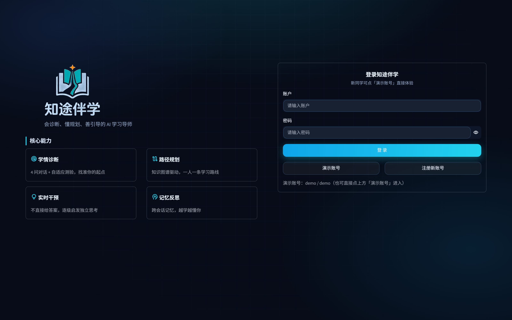

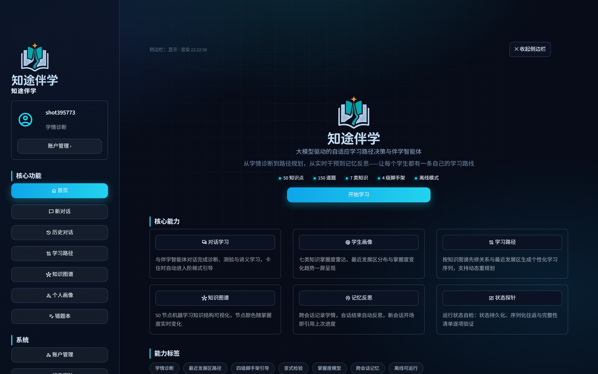

## 3.2 学情诊断模块

**功能描述**：通过 4 问对话（称呼/学校专业/数学与机器学习基础/学习目标）采集背景，再以自适应测验沿主链双向搜索定位水平边界，输出学生画像（先验/目标/风格标签）与诊断报告（强弱节点/ZPD 带/建议起点）。

**实现要点**：

- 新学生点击「登录/开始学习」后直接进入 DIAGNOSING 状态，开场白即带第一问（"你好，我是知途伴学……怎么称呼你？"），减少交互轮次，如图3-3所示；
- 先验解析用规则引擎（PRIOR_RULES 词表匹配 + 程度词降级），目标解析映射到图谱关键词集（"深度学习"→14 个相关节点），直接驱动路径评分的目标相似度项；
- 真实大模型模式下，第②③问先由大模型按 JSON 模板提取先验/风格标签/目标（提取结果经图谱节点校验、强度限幅、空标签过滤），解析失败自动回退规则引擎——Mock 离线模式恒走规则，两种模式输出同构；
- 自适应测验由 AdaptiveQuiz 类驱动：答对沿主链上跳、答错下钻未覆盖先修，四个终止条件（覆盖≥6 主链节点 / ≥12 题 / 连续 4 题对错交替 / 题库耗尽）保证快速收敛，测验界面如图3-5所示；
- 测验逐题实时更新掌握度并落库，诊断报告与 ZPD 带直接作为路径规划输入，形成闭环，如图3-6所示。

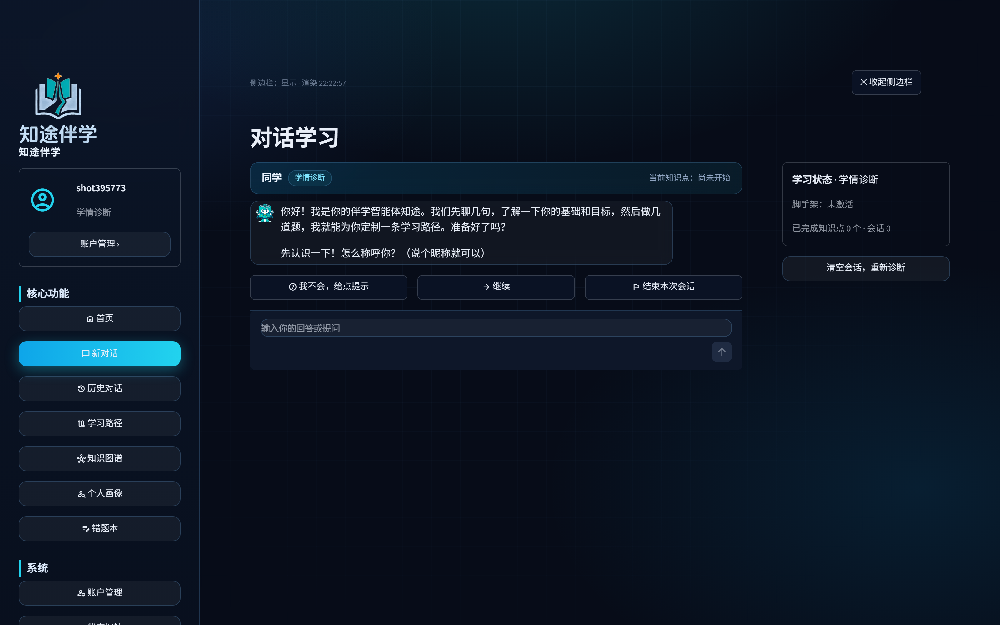

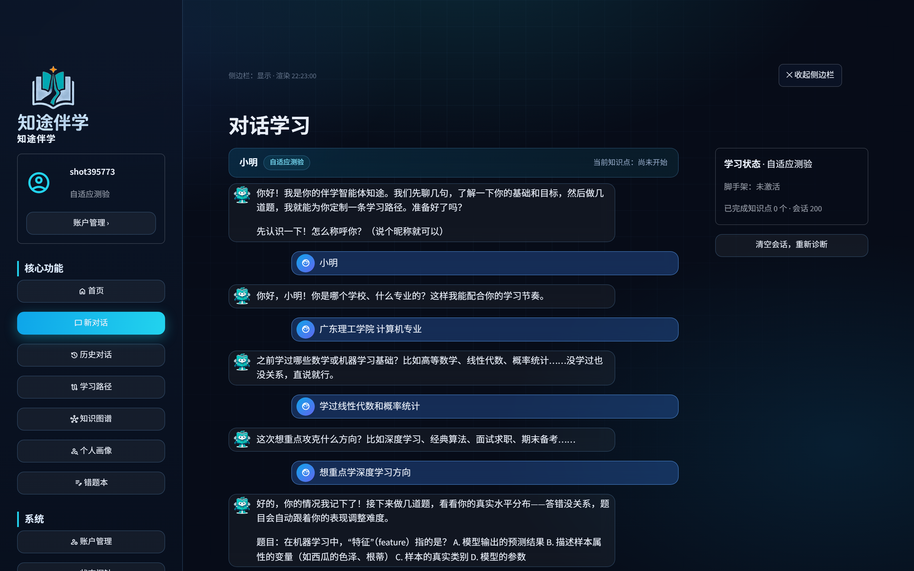


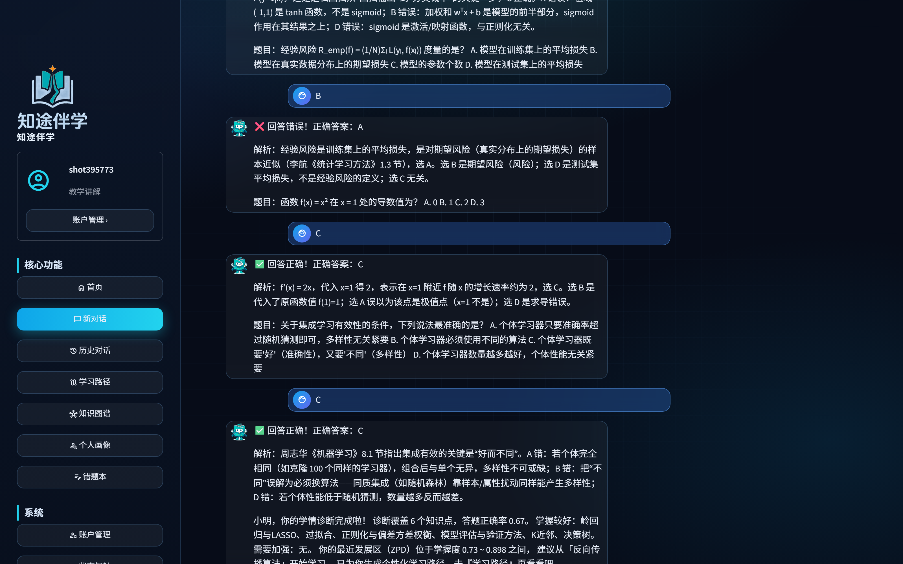

## 3.3 路径规划模块

**功能描述**：基于诊断画像输出学习路径：拓扑序保证先修在前，ZPD 带分档（主修/复习/暂缓），五维评分筛选候选，大模型定序输出最终顺序与逐条理由，节奏参数决定每批学习量；支持手动重新规划与动态重规划。

**实现要点**：

- PathPlanner.plan(profile, batch)：Kahn 拓扑分层 → 前沿集过滤（先修加权均值 ≥0.6 且 θ<0.75）→ ZPD 三档 → 评分（0.30·ZPD+0.25·(1−θ)+0.20·中心性+0.15·目标相似度+0.10·认知契合）贪心选批；
- LLM 定序（Orchestrator._llm_order）：公式结果作候选集，LLM 读学情统计（stats_json）与候选清单输出最终顺序、面向学生的逐条理由与整体安排说明；node_id 校验不过或调用失败整体回退公式，路径页展示决策引擎标记；
- 节奏参数 pace = clip(0.5+0.8(acc−0.70)−0.10·stuck, 0.4, 1.6)，batch=round(3·pace)：测验正确率与卡住次数共同决定学习节奏；
- 每次规划版本落库（study_plans 表），路径页可查看历史版本，如图3-7所示；展开"评分构成"可逐项核对五维评分，如图3-8所示；
- 动态重规划：卡死 L3/先修崩塌/目标变化/反思建议四类触发，LLM 输出结构化 JSON（Mock 模式规则兜底），回补最弱先修节点并插入计划队列。

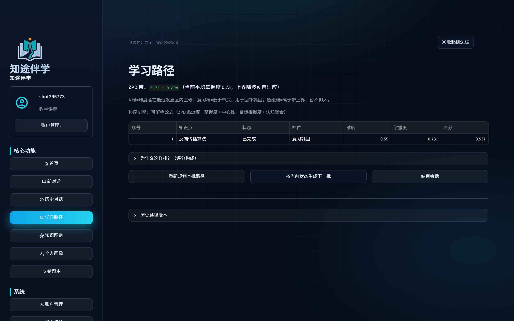

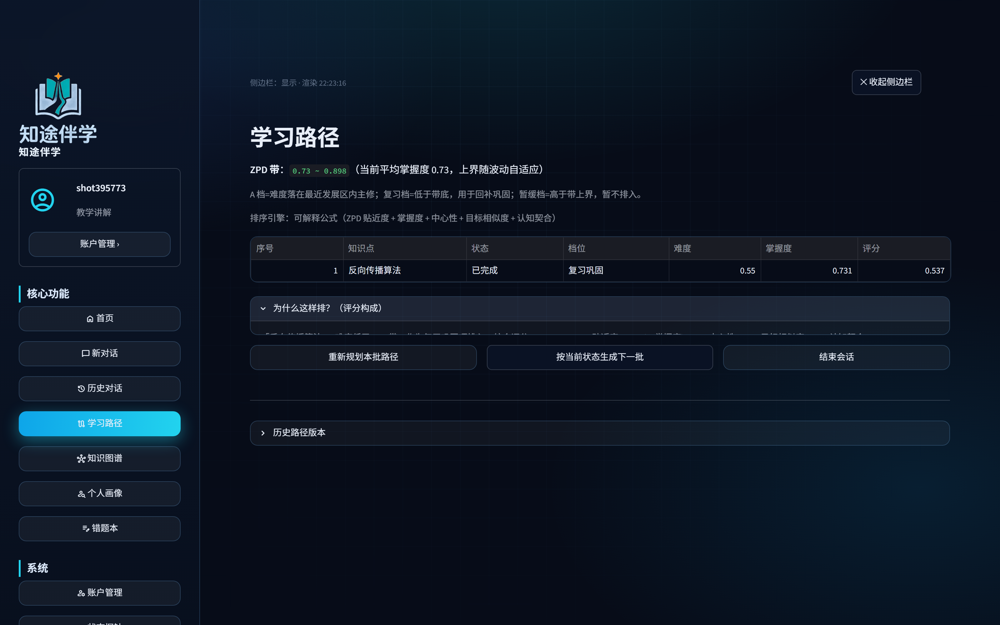

## 3.4 实时干预模块（脚手架）

**功能描述**：学生答错或表达困惑时，不公布答案，而是按 L0 苏格拉底反问 → L1 概念提示 → L2 类比样例 → L3 分步解析 + 变式检验逐级支撑；答对即退出并记录提示档案。教学阶段的分段讲义推进如图3-9所示。

**实现要点**：

- 卡住判定为 OR 信号组（连错≥2 / 近3轮正确率<1/3 / 困惑词 / 连续2轮求助），由 detect_stuck 实现并实时监控；
- 提示素材锚定题库 hints 字段与讲义 [ASK:] 提问位（L0 反问优先取提问位），Mock 模式完全由数据驱动、不依赖模型生成——防幻觉的关键设计，L0 反问界面如图3-10所示；
- 变式检验：L3 解析后换表述与数据出变式题（如图3-11、图3-12所示），答对才算"真理解"；变式仍错触发 LLM 重规划，回补当前节点最弱的先修（干预与路径规划联动）；
- 每次提示使用记录落库（hint_usage 表），形成学生提示档案供反思分析。

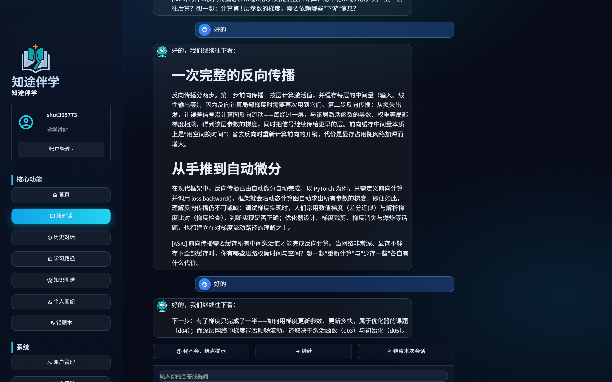

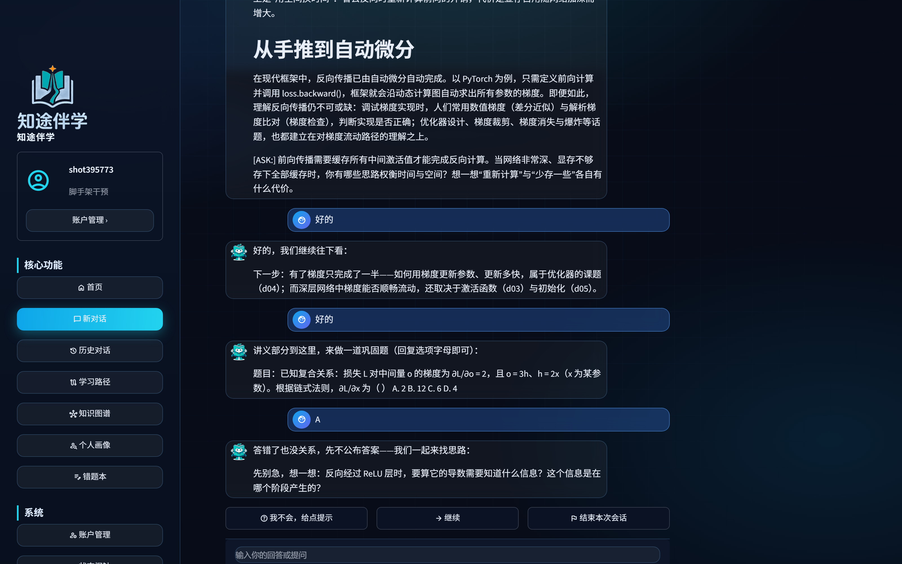

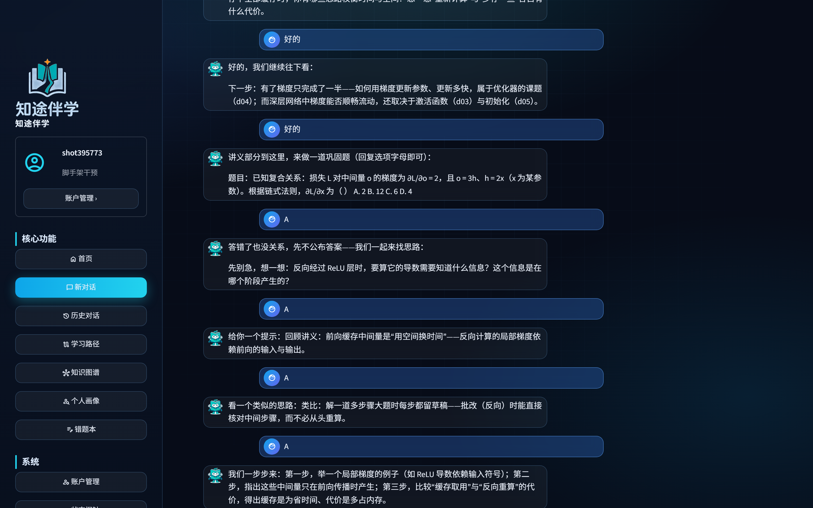

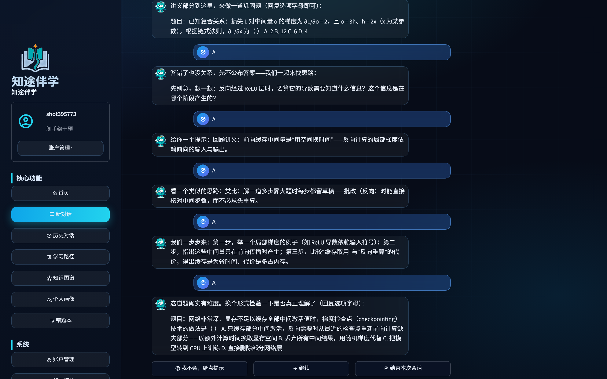

## 3.5 记忆与反思模块

**功能描述**：SQLite 9 表完整记录学生账户、画像、会话、交互、掌握度快照、反思摘要、计划版本、提示记录与画像观察记录；会话结束/节点完成/卡死/周期四类时机触发反思；新会话开场白引用上次学习记忆，实现跨会话教学连贯。

**实现要点**：

- 全表操作线程安全（check_same_thread=False + 全局读写锁），适配 Streamlit 多线程 rerun；
- 掌握度快照按知识点落库，画像页趋势线直接读取快照序列；
- 反思由 LLM 压缩生成四段式输出（进展/有效策略/计划调整/下次预告），Mock 模式模板兜底；LLM 失败不影响主流程（try/except 保护）；
- 「结束」进入 REFLECTING 状态完成反思落库（如图3-13所示）；说「继续」即开新会话并引用 next_session_preview（"欢迎回来，上次你卡在……"），如图3-14所示；
- 画像持续观察：会话结束与空闲超 5 分钟时，把近期交互与画像统计交给大模型（_update_profile_from_conversation），输出新标签/目标更新/观察结论并落 profile_observations 表（画像页「大模型观察记录」时间线展示），失败回退规则、无效输出不落库；
- 错题本与历史对话两个页面沉淀学习轨迹（如图3-15、图3-16所示），错题本按知识点聚合错题与解析，历史对话可按日期回看会话记录。

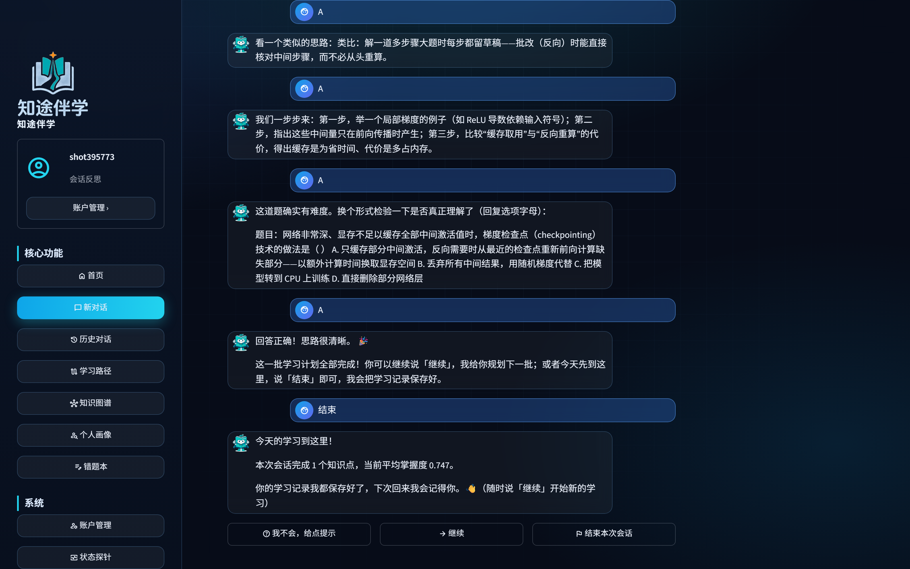

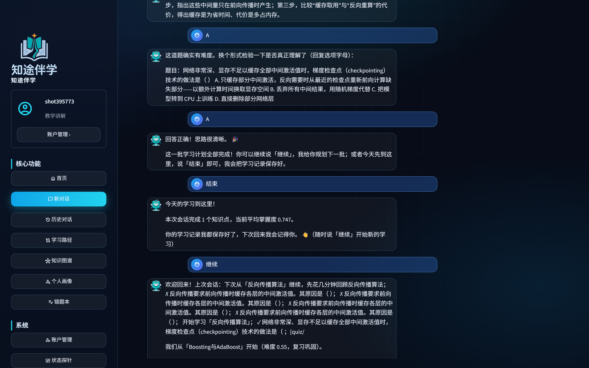

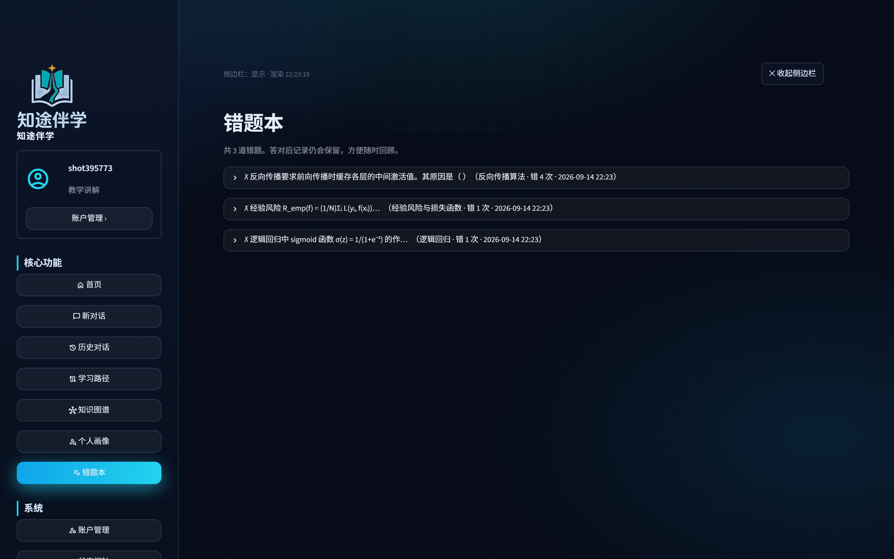

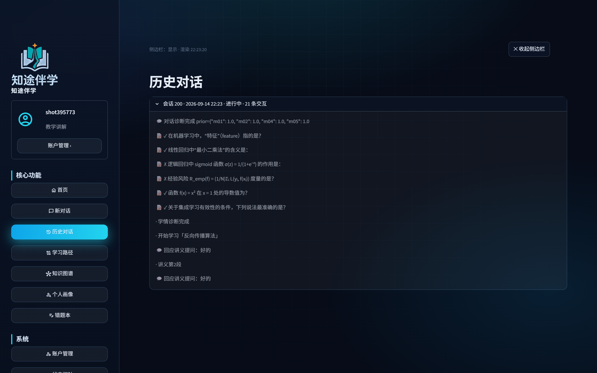

## 3.6 知识图谱可视化模块

**功能描述**：50 节点知识图谱网络图：节点颜色 = 掌握度（红→黄→绿），金色描边 = 当前学习路径，星标 = 正在学习的知识点，先修边按拓扑层从左到右布局，如图3-17所示。

**实现要点**：

- networkx 计算拓扑层与度中心性（布局 + 评分复用同一图结构）；
- plotly 手绘节点/边轨迹（无依赖额外图布局库），悬停显示知识点名称与掌握度；
- 颜色映射 RdYlGn 色带，与画像页/路径页配色一致。

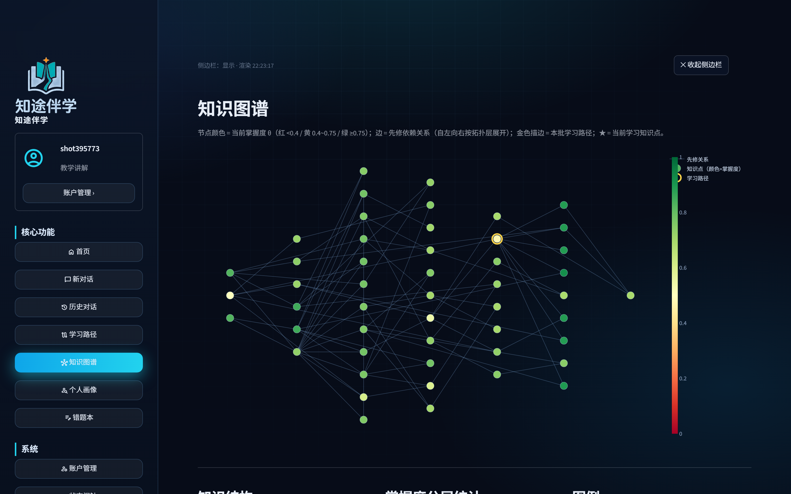

## 3.7 学生画像可视化模块

**功能描述**：三类视图呈现学情：①七类知识掌握度雷达图；②难度-掌握度散点 + ZPD/复习/暂缓三带叠加图；③掌握度随时间变化趋势线；附诊断报告摘要与「大模型观察记录」时间线——画像随对话持续生长的过程一目了然，如图3-18、图3-19所示。

**实现要点**：

- 雷达图按 7 类别聚合平均掌握度，一屏看懂强弱科目；
- ZPD 分布图用 vrect 色带把 2.9.2 的分档逻辑可视化——"为什么推荐这些节点"有图可依；
- 趋势线数据来自 mastery_snapshots 表，跨会话连续；
- 「大模型观察记录」读取 profile_observations 表按时间倒序展示每次观察的时间、触发原因（会话结束/空闲跟进）与画像增量；查看自己画像且空闲超 5 分钟时，先让大模型跟进一次再展示。

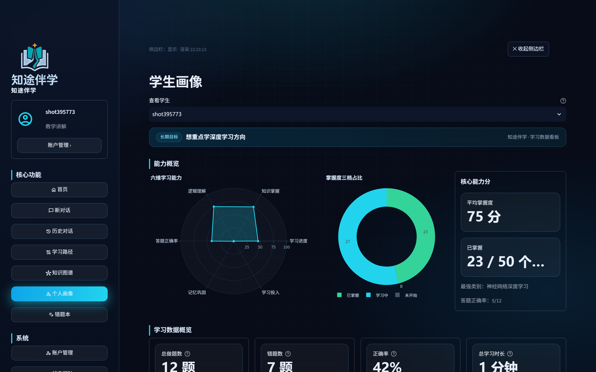

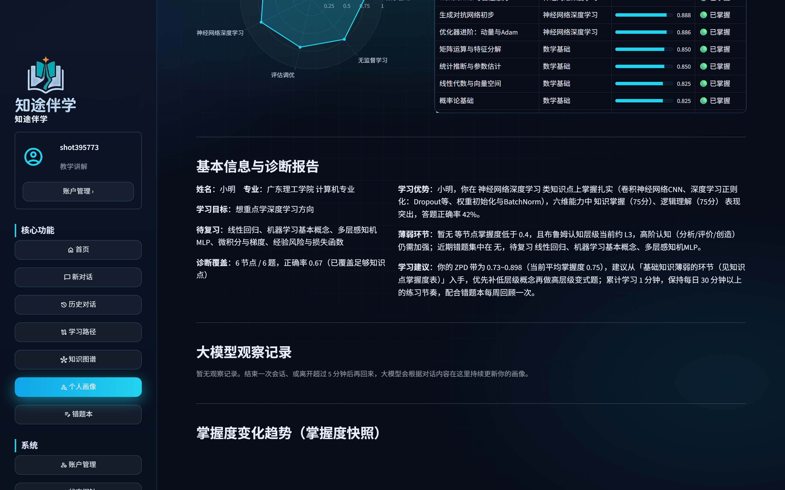

## 3.8 状态探针与工程质量

**功能描述**：开发自检页（也是工程质量的体现）——验证 AgentState 在 Streamlit 全脚本 rerun 后完整存活、可序列化往返，并实时展示状态完整性清单，如图3-20所示。

**实现要点**：

- Streamlit 每次交互都会整脚本重跑，Agent 状态必须完整驻留 session_state；探针页作为开发阶段门禁：修改状态→点按钮触发 rerun→断言状态不丢，通过后才开发业务页面（先验证地基再盖楼）；
- 序列化往返断言：to_dict→from_dict→to_dict 全等，保证状态可持久化到任意介质；
- 四项完整性清单：画像对象/掌握度条目数=图谱节点数/对话历史/计划结构。

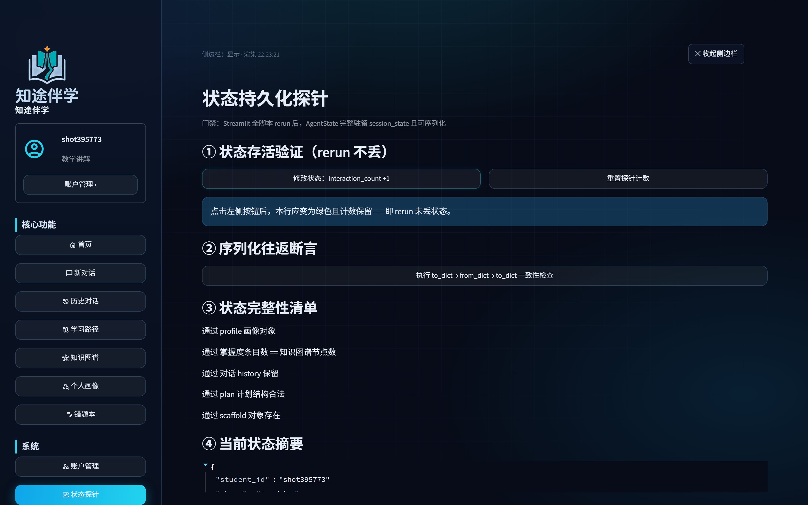

**自动化测试**：全系统 107 个 pytest 用例（单元/集成/端到端 8 幕剧本/UI 无头冒烟）全部通过，详见第4章。
