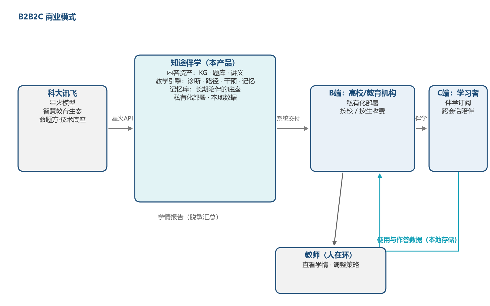

# 第5章 商业价值

本章回答两个问题：**与谁比、凭什么赢**（5.1 节），以及**怎么赚、怎么与命题企业合作**（5.2—5.7 节）。需要先说明本项目的基本定位：不与大厂比拼模型规模，不与学术系统比拼前沿算法，而是以"可解释、零成本、可私有化"为差异化轴心，把教育数据挖掘领域数十年积累的成熟方法（BKT、Elo、ZPD、脚手架）与命题企业的大模型能力，工程化地整合为一套可演示、可验证的完整系统。

## 5.1 竞争优势与创新点

### 5.1.1 竞争对比

对比对象选取教育技术领域的三类典型路线：以协同过滤与知识图谱推荐为代表的**传统推荐系统**、以直接问答为代表的**通用大模型答疑产品**、以 DeepTutor（HKUDS，Agent 原生个性化学习助手，多智能体编排＋三层记忆架构）为代表的**学术研究系统**。七项对比维度与命题要求的个性化、可解释、主动引导一一对应。

**表5-1 竞争对比表**

| 对比维度 | 传统推荐系统（协同过滤 / 知识图谱推荐） | 通用大模型答疑（直接问答） | DeepTutor 等学术系统 | 知途伴学（本项目） |
| --- | --- | --- | --- | --- |
| 掌握度建模 | 隐式建模：以行为相似度或图谱相关性代替"掌握度"，无显式学情概念 | 无掌握度概念，回答与学生水平无关 | 有统一学习者画像与知识掌握估计，但估计过程不输出公式依据 | 显式公式 θ′ = θ + K(c − p)（BKT 简化＋Elo 自适应学习率），每次更新可溯源、可复核 |
| 路径规划 | 按相似度/最短路径推荐，缺乏教育学约束，"为何先学它"说不清 | 无路径规划能力 | 基于画像的个性化学习路径设计，依赖多智能体编排，架构重、难私有化 | 拓扑分层保先修＋ZPD 难度带＋节奏参数，每步推荐输出可解释理由 |
| 干预方式 | 推送题目与资源列表，无对话式引导 | 问什么答什么，直接给答案，削弱独立思考 | 智能体教学对话、引导式设计，依赖大模型在线推理 | L0~L3 四级脚手架（反问→提示→样例→解析），只引导不代答，末了变式检验闭环 |
| 记忆机制 | 仅行为日志（点击/作答记录），无反思、无跨会话叙事 | 会话结束即失忆；即便挂载外部记忆也只是检索拼接 | 三层记忆架构（摘要/画像/交互轨迹）完整，但依赖向量库等重组件 | SQLite 9 表＋会话反思摘要＋跨会话开场白，单文件、零运维 |
| 离线可用性 | 依赖服务端与训练好的模型，通常需联网 | 必须联网调用 API，断网不可用 | 需 LLM API 与外部服务，离线不可运行 | 无 API Key 时 MockLLM 兜底，100% 离线全功能运行，断网可完整演示 |
| 可解释性 | 黑盒：推荐理由不可解释，师生难以信任与修正 | 生成过程黑盒，且存在幻觉风险 | 画像与教学策略部分透明，掌握度估计与路径决策仍为黑盒 | 全链路白盒：掌握度公式、ZPD 带、脚手架层级、路径理由全部显式输出 |
| 部署成本 | 需模型训练与推荐服务运维，中等偏高 | 按 token 计费，边际成本随用量线性增长 | 多智能体＋向量库＋大模型，部署与运维门槛高 | 运行依赖仅 7 个开源库，单机零成本运行，可私有化部署，数据不出校 |

**差异化结论**：传统推荐系统缺教育逻辑，通用答疑缺个性化与引导，学术系统全面但重而难落地。知途伴学的差异化不在于任何单项指标"超过谁"，而在于把三者互补的价值——**个性化（学得会）、引导性（教得对）、可解释（信得过）、零成本（用得起）**——以最轻的工程形态装进一台普通电脑。这一组合恰好对应命题"从被动答疑到主动引导"的范式要求：个性化是前提，引导是手段，可解释是信任基础，零成本是落地条件。

### 5.1.2 创新点一：可解释掌握度模型——让"学得怎么样"有公式可依

掌握度模型是全部决策的底座，本项目选择"显式公式"而非"深度学习黑盒"，核心公式为：

[F] θ′ = θ + K·(c − p)

其中 c 为答题实际表现（答对为 1、答错为 0），p 为模型对当前表现的概率预测（经 sigmoid 映射），K 为学习率。

该公式融合两条成熟学术路线：**BKT（贝叶斯知识追踪）简化**——用"答题证据"更新掌握概率，符合教育学直觉；**Elo 自适应学习率**——学习率 K 随答题次数衰减，早期快速修正初判、后期稳定收敛，避免一次发挥失常过度改写画像。在此基础上还实现三项细化机制：答对后向后继知识点**传播 +0.05**（学了梯度下降，微积分基础自然更牢）、答错时回标先修知识点 **−0.03**（提示"卡在反向传播，先补链式法则"）、跨会话**遗忘衰减** exp(−0.02·Δt 天)（两个月没复习，掌握度如实回落）。

创新价值在于**可解释性**：每一次掌握度变化的"为什么"都写在公式里——教师可以复核"这个 0.73 是怎么来的"，学生可以看懂"为什么我该复习它"，评委可以现场验证"公式与代码是否一致"。全部更新逻辑离线单元测试回归（107 个用例全部通过，测试细节见第4章），不依赖任何训练数据即可保证行为正确。

### 5.1.3 创新点二：ZPD 最近发展区路径规划——千人千面，且理由可讲

路径规划采用三维决策，每一步都有明确的教育学依据：

1. **拓扑分层**——按 50 节点、81 条先修关系的知识图谱做拓扑排序，保证"先学梯度下降、再学反向传播"的先后次序不被打破；
2. **ZPD 难度带**——把维果茨基"最近发展区"量化为难度带 [mean(θ), min(mean＋0.15＋0.35σ, 0.95)]，带内知识点"主修"（跳一跳够得着）、带下知识点"复习"（补先修短板）、带上知识点"暂缓"（太难会挫败）；
3. **节奏参数**——以答题准确率与卡住次数调节推进速度，学得稳则快进、频繁卡壳则放缓并回补。

[F] 候选知识点评分 = 0.30·ZPD适配 + 0.25·(1−θ) + 0.20·图谱中心性 + 0.15·目标相似度 + 0.10·认知契合

权重公开、结果可复算。同一份图谱与题库，不同学生走出不同路径；画像每更新一次，路径随之重规划。创新价值在于**千人千面与可解释兼得**：路径因人而异，但"为什么是他学这个"永远有据可查、可被教师修正。

### 5.1.4 创新点三：四级脚手架干预——引导式教学的产品化实现

当学生在问答或测验中卡住时，系统不直接给答案，而是按四级阶梯逐级升级支撑：

- **L0 苏格拉底反问**：不提供任何信息，用问题引导学生自己发现关键线索（"如果不做标准化，权重大的特征会怎样？"）；
- **L1 概念提示**：提示相关概念的定义或位置，点到为止；
- **L2 类比样例**：给出同构的类比或相似例题，让学生迁移方法；
- **L3 分步解析**：分步拆解思路（仍不给完整答案），并在学生作答后**变式检验**——换一道同知识点变式题确认"真学会"而非"记住答案"；变式仍错则触发路径重规划，回补先修知识点。

创新价值有三：其一，**教育学正确性**——苏格拉底式引导是学界公认的培养独立解题能力的路径，本项目将其从理念落地为可测试的规则；其二，**防幻觉锚定**——干预内容以题库内置提示为锚（150 题，每题含 L0~L3 四级提示）与讲义原文为据，大模型只做语言组织、不做知识发明，从机制上压制大模型幻觉；其三，**闭环检验**——变式检验把"教学动作"与"学习效果"挂钩，干预是否有效有数据可查。

### 5.1.5 创新点四：离线双模式架构——零成本可演示、一键接星火

LLM 层采用**双通道设计**：每条消息同时携带结构化标记（模板路由键）与原始素材（讲义原文、题干），MockLLM 按路由键生成确定性的强引导输出，真实大模型按 OpenAI 兼容接口处理同一素材——**Mock 模式与真实模式共用同一接口契约**。由此获得三个工程特性：

- **无 Key 全功能**：未配置任何 API Key 时系统自动降级 Mock 离线模式，诊断、路径、教学、干预、记忆全部功能 100% 可用，开发、演示、交付全程不中断；
- **断网可演示**：答辩现场、评审教室断网也不影响任何环节，演示确定性高（Mock 输出可预期，不依赖网络波动）；
- **换 Key 即接命题企业模型**：在配置中写入星火 base_url（spark-api-open.xf-yun.com）与 Key 即切换真实星火大模型——本项目已完成与星火 Lite 的真实联调（2026-09-14 实测通过，见 5.7 节）；DeepSeek、Qwen、GLM 等 OpenAI 兼容服务同理，接口契约一致、一行配置完成切换。

创新价值在于**把"低成本"做成竞争力**：对学生团队意味着零预算完成开发与演示；对学校意味着私有化部署、数据不出校；对命题企业意味着"演示即接入"——系统交付时已是星火生态的可运行组件。

## 5.2 商业模式

知途伴学以"**内容资产＋教学引擎**"为核心，采用 B2B2C 模式：面向高校与教育机构（B 端）提供教学平台与学情分析服务，机构采购后带动学生（C 端）使用伴学服务，C 端订阅与使用数据反哺内容与引擎迭代，如图5-1所示。教师既是 B 端决策链上的影响者，也是产品的直接使用者。

- **B 端（高校 / 教育机构）**：私有化部署与运维、课程知识图谱定制（换课程不换架构）、班级学情分析报告、教师使用培训；
- **C 端（学习者）**：伴学智能体订阅——诊断、路径、引导、记忆四能力一体，随时开始、跨会话延续；
- **目标客户画像**：商业模式视角下，B 端决策方（教务处、学院、机构负责人）的核心关切是**数据不出校、决策可解释、部署零负担**；C 端使用者的核心关切是**路径合理、引导到位、记得住我**。用户群体分类与优先级详见 1.5 节，此处不赘述。

## 5.3 轻量成本结构

本项目的成本结构刻意做到"最轻"，如实测算如下：

**表5-2 成本结构表（金额为估算）**

| 成本项 | 构成 | 量级（估算） | 说明 |
| --- | --- | --- | --- |
| 开发成本 | 团队人力 | 以机会成本计（学生团队以赛代练，无外包支出） | 系统开发期间未产生任何软件采购费用 |
| 软件授权 | 技术栈授权 | 0 元 | 全部为免费开源组件：Python / Streamlit / SQLite，运行依赖仅 7 个开源库（streamlit、plotly、networkx、jieba、pyyaml、openai 兼容层、pytest） |
| 基础设施 | 服务器 / GPU | 0 元（开发与试点期） | 单机本地运行，无云服务器、无 GPU、无图数据库 |
| 运营成本（模型） | 大模型 API 调用费 | 小规模试点下近零边际成本 | 星火 Lite 提供永久免费额度（团队已实际领取并完成联调，见 5.7 节） |
| 运营成本（数据） | 数据存储 | 近零 | SQLite 本地单文件存储，无云存储费用 |
| 运营成本（推广） | 试点运营与内容维护 | 以机会成本计（估算） | 课程内容更新、试点校驻场支持 |

两点如实说明：其一，**开发成本＝人工＋免费开源技术栈**，这是学生团队以"零预算出完整系统"的前提；其二，运营成本的最大变量是**大模型 API 调用费**，在星火免费额度覆盖下小规模试点运营边际成本接近零，规模扩大后转为按量付费、成本随用量线性增长，但仍显著低于自建 GPU 推理或采购商业题库的成本。免费额度政策存在调整可能，团队已按"多引擎可替换"设计对冲（见 5.5 节）。

## 5.4 营收预估（三档情景，全部为估算）

营收设计为三种收费形态，与 B2B2C 结构一一对应：

1. **高校年度服务费**：私有化部署＋学情分析报告＋课程知识图谱定制，**0.5 万～3 万元/校·年（估算）**；
2. **机构按学生数订阅**：教育机构按注册学生数采购伴学服务，**20～50 元/生·学期（估算）**；
3. **学习者订阅**：个人用户订阅伴学服务，**88～199 元/人·年，或 9.9～19.9 元/月（估算）**。

**表5-3 三档情景营收测算（估算，仅用于验证商业模式可行性，不构成预测或承诺）**

| 情景 | 关键假设（估算） | 年收入区间（估算） |
| --- | --- | --- |
| 保守（第 1～2 年） | 高校试点 5 校 × 0.5 万～1 万元；机构 1 家 × 1000 生 × 20～30 元；个人订阅 500 人 × 88 元 | 约 9 万～13 万元/年 |
| 中性（第 2～3 年） | 高校 20 校 × 1 万～1.5 万元；机构 5 家 × 共 5000 生 × 30～40 元；个人订阅 3000 人 × 99～129 元 | 约 65 万～89 万元/年 |
| 乐观（第 3～5 年） | 高校 50 校 × 2 万～3 万元；机构 20 家 × 共 2 万生 × 40～50 元；个人订阅 1 万人 × 129～199 元 | 约 310 万～450 万元/年 |

三点审慎说明：**其一**，以上数字全部为团队自行设定的情景假设，用于测算商业模式的成立条件，不包含任何市场承诺成分，市场容量与用户基数数据见第1章；**其二**，第一阶段（1～2 年）以**免费试点**为主——用免费部署换取课堂实测数据与教学效果案例，收入主要来自少量 B 端试点服务费，此时运营成本由星火免费额度覆盖，现金流压力小；**其三**，定价参照教育信息化服务与学习类订阅的常见区间设定下限，实际定价将依据试点校反馈调整。

## 5.5 风险与对策

**表5-4 风险与对策表**

| 风险类别 | 具体风险 | 对策 |
| --- | --- | --- |
| 技术风险 | 大模型幻觉：编造知识点、给出错误解析，损害教学可信度 | 题库 hints 锚定＋讲义原文注入：干预与讲解以自建题库（150 题 × L0~L3 四级提示）与讲义原文为唯一知识来源，大模型只做语言组织、不做知识发明；无 Key 时 Mock 兜底保证底线质量 |
| 数据风险 | 学情隐私：学生画像、作答轨迹、对话记录均为敏感教育数据 | 本地 SQLite＋最小化采集：全部数据存储在部署方本地单文件数据库，数据不出校；仅采集与学习诊断直接相关的最小字段，不收集无关个人信息 |
| 商业风险 | 竞争挤压：头部厂商及命题企业自有产品（AI 学习机、智学网等）覆盖面广 | 讯飞生态互补定位：不与既有产品正面竞争，聚焦其相对薄弱的大学段与"可私有化轻量组件"位置（见 5.6 节），做生态补位者而非替代者 |
| 依赖风险 | 模型 API 成本上浮或免费政策调整，抬高运营成本 | Mock 兜底＋多引擎兼容：无 Key 时全功能离线可跑；OpenAI 兼容抽象层一行配置切换 DeepSeek / Qwen / GLM 等，不锁定单一供应商，供应商政策变动不构成单点故障 |

## 5.6 与科大讯飞合作模式

团队以"产业命题赛道揭榜者"的身份规划与讯飞的合作，提出技术、内容、渠道、生态四条路径，由浅入深、层层递进：

**表5-5 与科大讯飞合作路径**

| 路径 | 层面 | 合作内容 | 现状 |
| --- | --- | --- | --- |
| 路径一：接入星火大模型 | 技术层 | 系统以星火为优先推荐的大模型引擎，配置即接入（OpenAI 兼容端点 spark-api-open.xf-yun.com/v1）；利用 Lite 永久免费额度支撑开发、演示与初阶运营 | **已完成接入与实测联调**（2026-09-14，见 5.7 节） |
| 路径二：共建学科知识图谱与题库 | 内容层 | 以本项目 50 节点《机器学习》知识图谱与 150 题题库（解析＋四级提示＋变式题）为起点，联合扩展更多学科与课程，探索纳入讯飞因材施教内容体系 | 规划中 |
| 路径三：智学网 / 高校智慧教育场景试点 | 渠道层 | 据团队调研（2026-09），讯飞智慧教育以 K12 为主、大学段相对薄弱，智学网亦未覆盖高校——本项目面向高校《机器学习》课堂的可私有化轻量组件，恰可补位其大学段生态增量场景 | 规划中 |
| 路径四：讯飞开放平台开发者生态 | 生态层 | 依托讯飞开放平台 HTTP 服务接口与星火 Lite 免费额度持续迭代；对标「星火杯」教育智能体赛事与讯飞高校共建范式（产业学院、联合实验室），形成长期人才与内容供给 | 规划中 |

**表5-6 双向资源清单**

| 我们为讯飞带来 | 讯飞为我们带来 |
| --- | --- |
| 面向高校场景、可运行的四能力闭环伴学原型（诊断 / 路径 / 干预 / 记忆），零成本、可私有化 | 星火大模型 API 与免费额度政策（Lite 永久免费，以官方实时政策为准） |
| 可解释教学决策模型（BKT+Elo、ZPD 带、四级脚手架），回应讯飞"从解题到伴学"的战略升级方向 | 智慧教育生态渠道：智学网、AI 学习机、智慧课堂、因材施教解决方案 |
| 50 知识点知识图谱、150 题题库、分段讲义等内容资产 | 行业品牌与命题背书、产教融合专家资源 |
| 大学段生态补位价值：高校《机器学习》课堂验证场景与在校师生试点资源 | 高校合作范式参考（产业学院、联合实验室、智慧校园基座等，2024—2026 公开案例） |
| 轻量"教育大模型＋知识图谱"工程化样本，愿意开源共建 | 开发者生态资源：讯飞开放平台、星火杯赛事通道 |
| 年轻开发者团队与开源社区传播意愿 | 国产自主可控教育大模型的叙事与展示平台 |

## 5.7 对接工作进展

**表5-7 对接工作进展表**

| 序号 | 事项 | 状态 | 说明 |
| --- | --- | --- | --- |
| 1 | 命题解读与需求对齐 | 已完成 | 对照命题四大能力完成应答映射（见表 1-1）；完成学术与开源路线调研（DeepTutor / EduChat / d2l-zh）与竞品分析 |
| 2 | 讯飞开放平台与星火 API 技术调研 | 已完成（2026-09-12） | 确认 OpenAI 兼容端点与鉴权方式、模型参数（Lite 等）与免费额度政策（星火 Lite 永久免费额度）；梳理智学网、智慧教育生态与高校合作案例 |
| 3 | 系统完成与双模式接口设计 | 已完成 | 全系统 107 个 pytest 用例全部通过；无 API Key 时 100% 离线运行；OpenAI 兼容层"换 Key 即接星火"，接口契约一致 |
| 4 | 星火 Lite 免费额度领取 | 已完成 | 已在讯飞开放平台领取 Spark Lite 永久免费额度（HTTP 服务接口），控制台可查实时用量与认证信息 |
| 5 | 星火 Lite HTTP 接口联调 | 已完成（2026-09-14） | 系统真实大模型模式接入 spark-api-open.xf-yun.com/v1/chat/completions 实测通过：文本补全约 1.8 秒返回、结构化 JSON 提取约 1.2 秒返回、零次降级；Mock 离线模式与真实星火模式共用同一套代码与接口契约 |
| 6 | 智学网共建交流 | 待启动 | 拟通过产业命题赛道对接渠道与讯飞产教融合团队建立联系 |
| 7 | 讯飞专家 / 产教融合团队沟通记录 | 待启动 | 拟依托「星火杯」等公开赛事通道申请讯飞官方资源扶持 |

后续动作按大赛时间表推进：**2026-09-15 提交项目书**后，通过产业命题赛道对接渠道与讯飞产教融合团队建立联系，使合作从"接口接入、真实调用"走向"真实试点"——争取智学网或高校智慧教育场景的试点机会，让本系统成为讯飞大学段生态的可私有化轻量组件。
