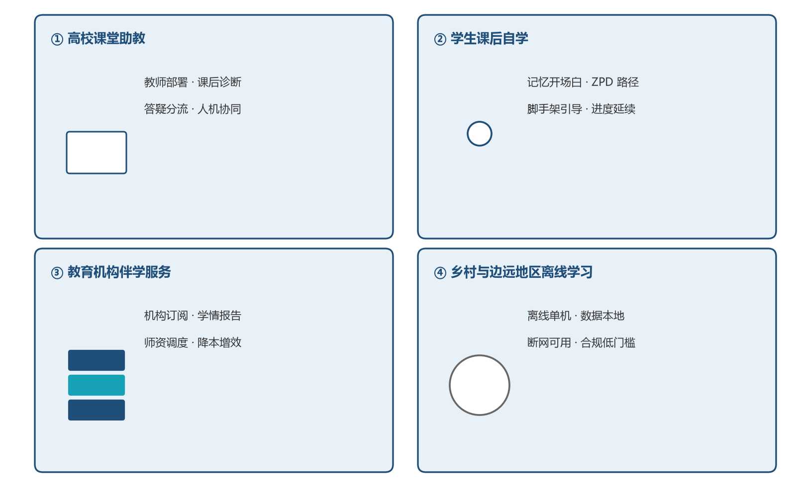

# 第6章 社会价值

前面五章证明了系统的可行性，本章回答"值不值得做"。知途伴学的社会价值不在于某个炫目的技术指标，而在于四个朴素的结果：让个性化学习不再是稀缺资源、让教师从重复劳动中解脱、让学情第一次三方共读、让 AI 素养教育有一个看得见的样本。四个典型应用场景如图6-1所示。

## 6.1 社会价值

**（1）教育公平：让个性化学习不再是稀缺资源。** 系统单机零成本运行——无需 GPU、无需付费 API、断网可用，一台普通电脑即可部署。"千人千面"的个性化路径与引导式辅导，由此可以走进欠发达地区、乡村学校与经费紧张的院系，让学习起点不同的学生获得同等质量的"一对一"引导。教育公平的缺口往往不是"没有课"，而是"没有针对我的课"，本项目把后者的成本降到了零。

**（2）教师减负：把教师从重复劳动中释放出来。** 系统承接大量重复性答疑、基础诊断与巩固训练，教师从"一人对百人"的逐题解答中解脱，聚焦高阶指导与教学设计；班级学情分析报告让教师批量掌握全班掌握度分布与共性卡点，备课与讲评有的放矢。伴学智能体承担"平时陪伴"，真人教师承担"关键点拨"，各司其职。

**（3）可解释学情：学生、教师、家长三方共读一份可信报告。** 掌握度由显式公式更新、路径带教育学理由、干预按规则分级——学生看懂"我为什么学这个"，教师看懂"系统为什么这样判断"，家长看懂"孩子卡在哪里"。教育场景中，可解释才可信任、可信任才可交付，这是本项目对"黑盒 AI 进课堂"担忧的正面回应。

**（4）AI 素养教育示范：用 AI 学知识，也看懂 AI 本身。** 学生不仅使用 AI 学习，还能直接看见它的决策逻辑——公式、规则、状态机全部白盒呈现，理解"大模型＋显式规则"混合架构的能力边界与局限（如大模型为何需要题库锚定防幻觉）。这一设计本身即是一堂关于 AI 能力与伦理的素养课，与高校人工智能通识教育方向一致。

## 6.2 应用场景

**场景一：高校课堂助教。** 任课教师为所授《机器学习》课程部署本系统，课后诊断、答疑分流、随堂测验与巩固训练全部自动完成。教师端查看班级学情概览，针对性调整授课重点；学生端获得随叫随到、记得住自己的课程助教。这一场景与命题企业"智慧课堂＋个性化学习"的产品理念同向，具备成为其大学段生态组件的条件（合作路径见 5.6 节）。

**场景二：学生课后自学。** 学生课下随时开始会话，系统以"接着上次"的开场白延续进度，按 ZPD 路径推进教学；卡住时四级脚手架逐级引导，答对后变式检验巩固。期末备考时，画像仪表盘一键定位薄弱知识点，复习有的放矢。

**场景三：教育机构伴学服务。** 培训机构为学员配发伴学账号，按学生数订阅；机构教师依据学情报告安排一对一辅导时段，把有限师资用在最需要的学员身上。机构获得可量化的学员学情数据，家长获得可读懂的进度报告，三方受益。

**场景四：乡村与边远地区自适应学习。** 在网络不稳定、经费有限的学校，以离线单机部署本系统，学生即可获得与发达地区同等质量的个性化学习路径与引导式辅导。数据全部本地存储，不依赖网络与外部服务，一次部署长期可用——这正是"教育公平"从口号变成配置项的最小可行路径。

需要如实说明的是：以上价值目前建立在原型系统的能力与 107 项自动化用例的验证之上，其真实教学效果尚需课堂实测数据的检验。团队将把试点反馈作为下一步迭代的第一输入（见总结章），让每一项社会价值都落到可验证的数据上。
