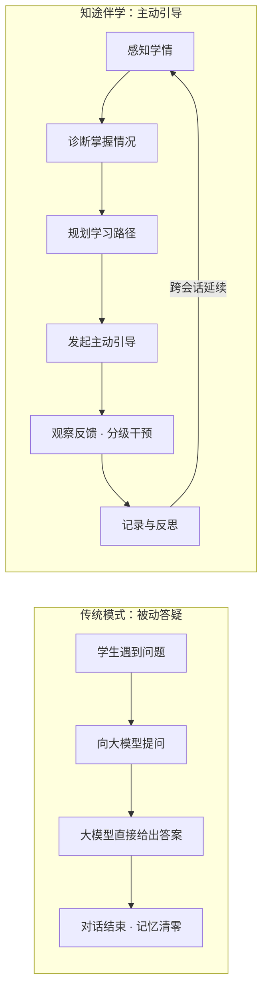
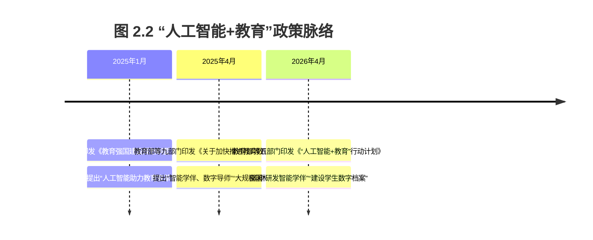
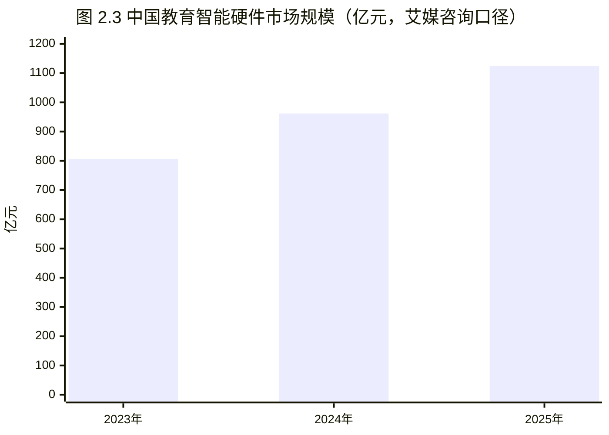
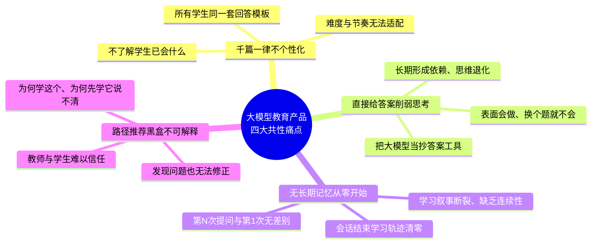
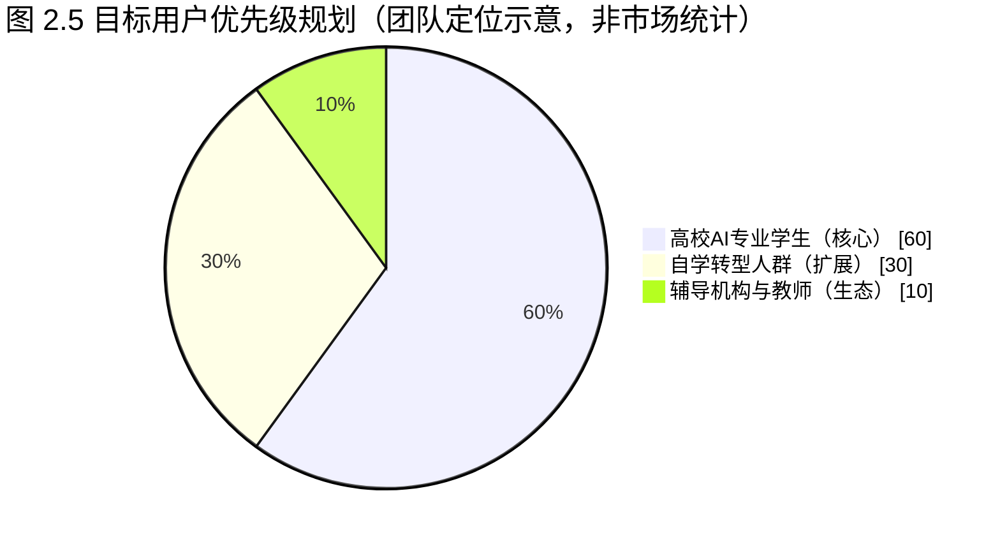
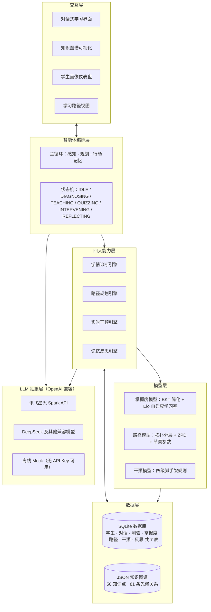
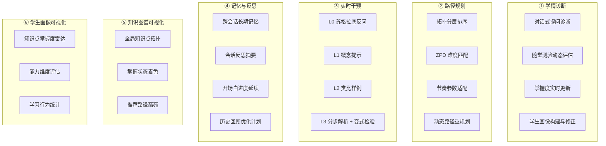
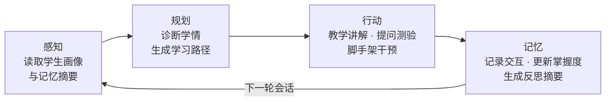
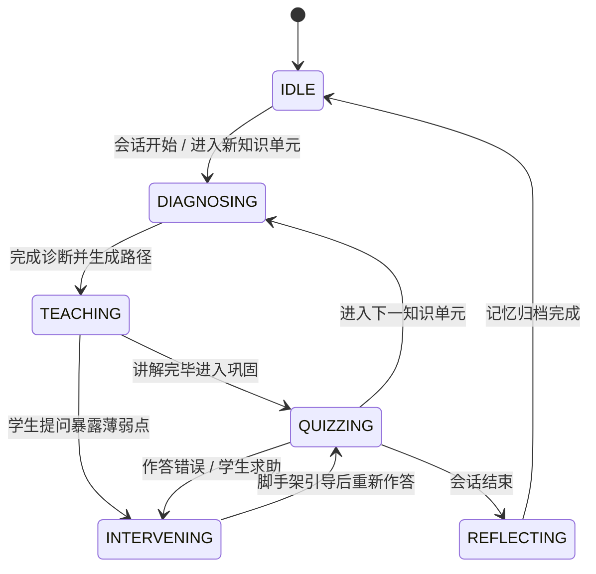
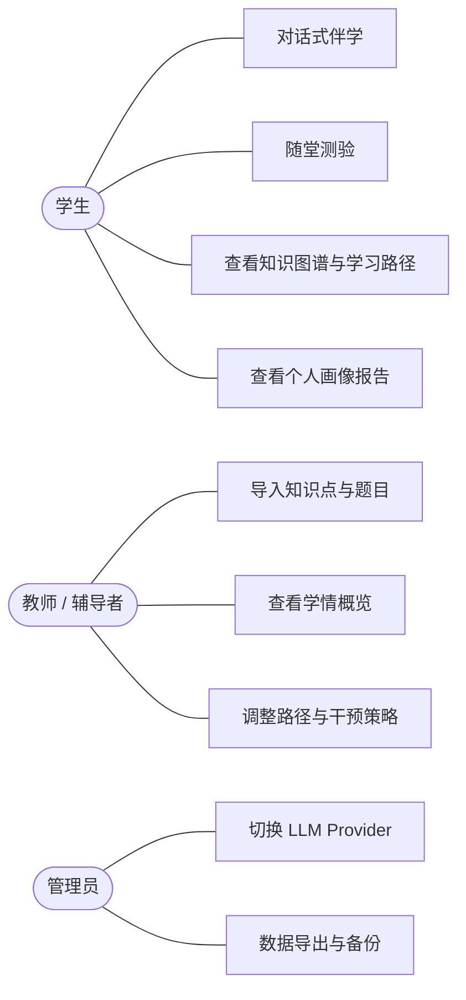

> 草稿，待插入截图与统稿（生成于 2026-09-12）。正文中以【图 x.x 截图待插入】标注的位置，将在系统实现与演示完成后补入实拍截图；市场数据均来自公开权威报告，来源清单见 2.2.4 节。

# 商业计划书（第 1～3 章）

**项目名称**：知途伴学——大模型驱动的自适应学习路径决策与伴学智能体

**学校 / 团队**：广东理工学院 · 知途伴学

**赛道**：中国国际大学生创新大赛（2026）产业命题赛道

**命题编号 / 命题企业**：命题九十六 · 科大讯飞

**命题名称**：大模型驱动的自适应学习路径决策与伴学智能体开发

---

# 第一章 执行概要

**一句话定位**：知途伴学是一款面向高校人工智能专业《机器学习》课程的主动引导式伴学智能体——以大模型为交互与推理引擎，以可解释的知识图谱与掌握度模型为决策底座，把"千人一面"的课程学习升级为"诊断—规划—干预—反思"闭环的个性化学习，实现从"被动答疑"到"主动引导"的教育范式跃迁。

大模型让"随时能问、随时有答"成为现实，却也暴露出四类共性问题：回答千篇一律、不看人下菜碟；学生问什么答什么、直接给答案，反而削弱独立思考；对话结束即失忆，每次学习都从零开始；学习路径推荐是黑盒，学生和教师既看不懂、也难以信任。知途伴学针对这四类问题，落地四大核心能力：

1. **学情诊断**——通过对话与随堂测验动态分析知识掌握情况与认知水平，构建并持续更新精准学生画像，让系统"先懂学生、再谈教学"。
2. **路径规划**——基于画像与 50 知识点知识图谱动态生成个性化学习路径，对学习顺序（拓扑分层）、内容难度（ZPD 最近发展区）与学习节奏（节奏参数）实现可解释的智能适配。
3. **实时干预**——采用"苏格拉底反问→概念提示→类比样例→分步解析＋变式检验"四级脚手架，只引导、不代答，把"抄答案"变成"学方法"，培养独立解题能力。
4. **记忆与反思**——以 SQLite 7 表沉淀跨会话长期记忆，会话结束时生成反思摘要，下一次对话自动延续上次的学习进度与未解之惑。

**成果亮点**：

- 面向《机器学习》课程构建了含 **50 个知识点、81 条先修关系**的 JSON 知识图谱，覆盖从数学基础到深度学习的主要教学内容；
- 掌握度模型采用"**BKT 简化 + Elo 自适应学习率**"，每一次掌握度更新都有可解释的公式依据；路径规划融合拓扑分层、ZPD 最近发展区与节奏参数，推荐结果可解释、可追溯、可修正；
- 四级脚手架干预与 SQLite 7 表长期记忆贯通"**感知→规划→行动→记忆**"智能体主循环与六态状态机，形成可演示、可验证的原型系统；
- 技术栈全部为**免费开源组件**（Python / Streamlit / SQLite），LLM 层采用 **OpenAI 兼容抽象**，可对接讯飞星火、DeepSeek 等主流大模型，无 API Key 时离线 Mock 运行——**零成本可运行、可私有化部署、数据不出校**。

**团队**：广东理工学院·知途伴学团队由 XXX、XXX、XXX 等同学组成（成员信息待补充），指导教师 XXX。团队坚持"教育学正确性优先、可解释性优先、可私有化部署优先"的工程原则，以可溯源的数据、可演示的系统、可验证的效果，回应科大讯飞命题九十六对"既懂知识、又懂学生"的 AI 导师的期待。

**表 1.1 项目概览**

| 项目 | 内容 |
| --- | --- |
| 赛道 | 中国国际大学生创新大赛（2026）产业命题赛道 |
| 命题编号 / 命题企业 | 命题九十六 · 科大讯飞 |
| 命题名称 | 大模型驱动的自适应学习路径决策与伴学智能体开发 |
| 学校 / 团队 | 广东理工学院 · 知途伴学 |
| 产品 | 面向人工智能专业《机器学习》课程的伴学智能体（原型系统） |
| 技术栈 | Python / Streamlit / SQLite / JSON 知识图谱（50 知识点·81 关系）/ OpenAI 兼容 LLM 抽象层（星火、DeepSeek，可离线 Mock） |
| 部署模式 | 单机零成本运行，可私有化部署，数据不出校 |

---

# 第二章 项目背景与市场需求

## 2.1 命题解读：站在科大讯飞的视角看这道题

### 2.1.1 讯飞智慧教育生态与命题的产业位置

科大讯飞自 2004 年起布局智慧教育，以星火大模型为技术底座，构建了"G 端区域因材施教—B 端学校智慧课堂—C 端个人学习机"的完整业务体系。截至 2025 年 6 月，讯飞智慧教育产品已服务全国 32 个省级行政区、**5 万余所学校、1.3 亿师生**；截至 2026 年 6 月，进一步覆盖 33 个省级行政区、**6 万余所学校、累计服务超 1.6 亿师生**（数据来源见 2.2.4）。其中，智学网已在全国 **3 万余所学校**常态化应用、受益师生超 4500 万；星火教师助手服务教师超 **80 万名**、日均互动率达 75%。媒体对讯飞教育业务升级方向有一句精准概括：**"从'解题'到'伴学'"**。

需要指出的是，现有星火教育产品体系主要解决"教的效率"——批阅、备课、组卷、讲评与区域治理。命题九十六要解决的是"学的深度"：一个**既懂知识、又懂学生、还能持续陪伴**的 AI 导师。这恰是讯飞生态从"工具层"向"伴学层"延伸的关键一步——AI 学习机需要更懂孩子的伴学策略，智学网的个性化学习手册需要可解释的路径决策，而高校人工智能人才培养场景，则需要一个能扎根课堂、可私有化部署、面向学生个体的伴学智能体。本命题在产业中的位置，就是讯飞"AI+教育"生态面向高等教育、面向学生个体深度陪伴的那块能力拼图。

命题原文进一步指出：个性化教育需求爆发，"千人一面"的教学模式难以满足多元化需求；知识图谱与推荐算法虽已应用多年，但缺乏灵活交互能力与深层推理能力；大模型智能体为构建"既懂知识又懂学生"的 AI 导师提供了可能；由此要求实现从"被动答疑"到"主动引导"的教育范式跃迁。这四句话依次点明了本命题的四个侧面：**需求侧**（大规模因材施教）、**技术侧**（知识图谱与推荐算法 × 大模型智能体的深度融合）、**产品侧**（AI 导师）与**范式侧**（主动引导）。知途伴学的全部设计，正是对这四句话的逐一应答。

### 2.1.2 命题内涵拆解与应答映射

**表 2.1 命题要求与知途伴学应答设计对照表**

| 命题要求（命题原文要点） | 知途伴学的应答设计 |
| --- | --- |
| 大模型驱动 | 构建 OpenAI 兼容 LLM 抽象层，统一接入讯飞星火（spark-api-open.xf-yun.com）、DeepSeek 等大模型；无 API Key 时离线 Mock 运行，开发、演示、交付全程不中断 |
| 自适应学习路径决策 | 拓扑分层保证先修关系、ZPD 最近发展区匹配内容难度、节奏参数适配个体学习速度；每一步路径推荐均给出教育学上可解释的理由 |
| 伴学智能体 | "感知→规划→行动→记忆"智能体主循环 + 六态状态机（IDLE→DIAGNOSING→TEACHING→QUIZZING→INTERVENING→REFLECTING），实现会话内的主动引导与会话间的记忆延续 |
| 能力一：学情诊断 | 对话 + 测验双通道动态诊断，BKT 简化模型 + Elo 自适应学习率实时更新掌握度，构建并持续修正精准学生画像 |
| 能力二：路径规划 | 基于画像与 50 知识点知识图谱动态生成个性化学习路径，实现学习顺序、内容难度、学习节奏三项智能适配 |
| 能力三：实时干预 | 四级脚手架式辅导（苏格拉底反问→概念提示→类比样例→分步解析＋变式检验），只引导、不代答，培养独立解决问题能力 |
| 能力四：记忆与反思 | SQLite 7 表跨会话长期记忆 + 反思摘要 + 跨会话开场白延续，基于历史反思持续优化后续学习计划 |
| 范式跃迁：从"被动答疑"到"主动引导" | 系统主动发起诊断、引导、追问与复习提醒，而非被动等待学生提问 |

### 2.1.3 范式跃迁：从"被动答疑"到"主动引导"

传统大模型教育产品的运行逻辑是"三幕剧"：学生提问 → 大模型作答 → 对话结束，系统对学生"是谁、会什么、卡在哪"一无所知，下一次对话依然从零开始。而知途伴学把交互重构为一个持续运行的闭环：系统先感知学情、再规划路径、继而主动发起引导，观察学生的反应后决定干预力度，最后记录并反思本次会话，为下一次主动引导做准备。

这一跃迁也与国家政策方向逐字对应：教育部等九部门文件明确提出"通过**智能学伴、数字导师**探索人机协同教学新模式，实现人工智能驱动的**大规模因材施教**"（2025 年 4 月）；教育部等五部门《"人工智能+教育"行动计划》将"**研发智能学伴**""建设学生数字档案"列为赋能学生学习的第一任务（2026 年 4 月）。知途伴学不是在做一个"更会答题的模型"，而是在做一个"更会教人、更懂学生"的智能体。

**图 2.1 从"被动答疑"到"主动引导"的范式跃迁**

## 2.2 行业背景与市场

### 2.2.1 政策环境：从"教育数字化"到"人工智能+教育"的顶层设计

本项目所处的政策环境可以用三份国家级文件勾勒出一条清晰的升级主线：

- **《教育强国建设规划纲要（2024—2035 年）》**（中共中央、国务院 2025 年 1 月印发）：将"建设学习型社会，以教育数字化开辟发展新赛道"列为重点任务，明确实施国家教育数字化战略、**促进人工智能助力教育变革**。
- **教育部等九部门《关于加快推进教育数字化的意见》**（教办〔2025〕3 号，2025 年 4 月 16 日发布）：提出"加快建设**人工智能教育大模型**"，"通过**智能学伴、数字导师**探索人机协同教学新模式，实现人工智能驱动的**大规模因材施教**"，并要求"建立基于大数据和人工智能支持的教育评价机制……开展**精准画像**"。本项目的"伴学智能体 + 学生画像 + 个性化路径"三大要素与该文件的关键表述逐字对应。
- **教育部等五部门《"人工智能+教育"行动计划》**（2026 年 4 月印发）：提出到 2030 年人工智能与教育深度融合格局基本形成；在"赋能学生学习"任务中部署"**研发智能学伴**、思政大模型，建设**学生数字档案**"；在高等教育领域推动人工智能成为高校公共基础课，并部署建设国家教育智能算力服务平台（教育智联网）与人工智能教育大模型。

结论是明确的：**智能学伴与个性化学习不是可选项，而是国家教育数字化战略的既定路径**。本项目方向的政策确定性高，属于"政策点名、企业出题、高校育人"三方交汇的赛道。

### 2.2.2 市场容量与增长趋势

从用户规模、市场规模与产业投入三个口径看，赛道处于高速扩张期：

**用户规模**：中国互联网络信息中心（CNNIC）第 57 次《中国互联网络发展状况统计报告》显示，**截至 2025 年 12 月，我国在线教育用户规模达 3.27 亿人**，刷新历史纪录。国家智慧教育公共服务平台累计注册用户突破 **1.64 亿**（2025 年 5 月《中国智慧教育白皮书》口径），汇集高等教育在线课程 **3.1 万门**——"课程资源极大丰富"与"个性化指导仍然稀缺"并存，正是伴学智能体的机会窗口。

**市场规模**：艾瑞咨询《2026 年中国 GenAI+ 教育行业发展报告》测算，**2025 年中国 GenAI+ 教育产品服务总规模约 3442 亿元，年复合增长率约 37%，预计 2028 年达 8910 亿元**，其中技术能力价值约 664 亿元；2025 年中国教育信息化数字化经费规模约 **5515 亿元**（校端市场）。艾媒咨询数据显示，中国教育智能硬件市场规模由 2023 年的 807 亿元增至 2024 年的 962 亿元，**2025 年达 1125 亿元（同比增长 16.94%）**，行业进入全民渗透阶段。

上述数据全部来自公开权威报告，本团队坚持"每处数据有出处、查不到可靠数据就定性表述"的原则，绝不使用无法溯源的数字。

**表 2.2 关键市场数据一览（逐条可溯源，详见 2.2.4 来源清单）**

| 指标 | 数值 | 统计口径 | 来源与年份 |
| --- | --- | --- | --- |
| 在线教育用户规模 | 3.27 亿人 | 截至 2025 年 12 月 | CNNIC 第 57 次《中国互联网络发展状况统计报告》，2026 年 2 月发布 |
| 高等教育在学总规模 | 4846.00 万人 | 2024 年 | 教育部《2024 年全国教育事业发展统计公报》，2025 年 6 月发布 |
| GenAI+ 教育产品服务总规模 | 约 3442 亿元（CAGR 约 37%，2028 年预计 8910 亿元） | 2025 年 | 艾瑞咨询《2026 年中国 GenAI+ 教育行业发展报告》，2026 年 2 月 |
| 教育信息化数字化经费 | 约 5515 亿元（2028 年预计 6802 亿元） | 2025 年，校端市场 | 同上 |
| 教育智能硬件市场规模 | 807 亿元 → 962 亿元 → 1125 亿元（+16.94%） | 2023—2025 年 | 艾媒咨询《2025—2026 年中国智能平板学习机市场趋势研究报告》等，2026 年 |
| 国家智慧教育平台注册用户 | 突破 1.64 亿（浏览量超 613 亿） | 截至 2025 年 5 月 | 教育部《中国智慧教育白皮书》，2025 年 5 月 |
| 高等教育在线课程资源 | 3.1 万门 | 截至 2025 年 4 月 | 教育部新闻发布会，2025 年 4 月 16 日 |
| 开设人工智能本科专业高校数 | 621 所（占全国普通高校比例超 50%） | 截至 2025 年 | 全国高校人工智能与大数据创新联盟《2025 全国 621 所普通高校人工智能专业教育教学综合实力排行榜》，2025 年 6 月 |
| 科大讯飞智慧教育覆盖 | 5 万余所学校、1.3 亿师生 → 6 万余所学校、超 1.6 亿师生 | 2025 年 6 月 → 2026 年 6 月 | 科大讯飞官方披露 / 兴业证券研报 |
| 智学网覆盖 | 32 个省级行政区、3 万余所学校、受益师生超 4500 万 | 截至 2025 年 | 科大讯飞官网 |
| 星火教师助手服务教师 | 超 80 万名，日均互动率 75% | 截至 2025 年 9 月 | 《杭州日报》报道，2025 年 9 月 |

### 2.2.3 高校人工智能人才培养的"量"与"难"

**"量"**：截至 2025 年，全国已有 **621 所普通高校**备案人工智能本科专业，占全国普通高校比例超过 50%；教育部《2024 年全国教育事业发展统计公报》显示，2024 年高等教育在学总规模达 4846 万人、普通本科招生 489.97 万人。这意味着每年有数十万计的新生进入人工智能及相关专业学习，《机器学习》是其中绕不开的核心课程。

**"难"**：其一，《机器学习》课程是数学推导、算法理解与工程调参的三重门槛，抽象性强、知识点先修关系严密（如不会"梯度下降"则无法真正理解"反向传播"），自学与班课学习都容易"卡点失焦"；其二，大班教学（动辄百人以上）决定了教师无法为每名学生提供一对一的诊断与引导；其三，行业报告同时指出，人工智能专业"师资力量仍较欠缺"。供给端的结构性缺口，恰恰是"既懂知识又懂学生"的伴学智能体的用武之地——**621 所高校、每所每届数百名学生，正是"大规模因材施教"最现实、最刚需的落地场景之一**。

### 2.2.4 本章数据来源清单

1. 中共中央、国务院《教育强国建设规划纲要（2024—2035 年）》（2025 年 1 月）：<http://www.moe.gov.cn/jyb_xwfb/xw_zt/moe_357/2025/2025_zt02/>；<http://politics.people.com.cn/n1/2025/0120/c1001-40404961.html>
2. 教育部等九部门《关于加快推进教育数字化的意见》（教办〔2025〕3 号，2025 年 4 月）：<http://www.moe.gov.cn/srcsite/A01/s7048/202504/t20250416_1187476.html>
3. 教育部等五部门《"人工智能+教育"行动计划》（2026 年 4 月）：<http://news.china.com.cn/2026-04/10/content_118429322.shtml>
4. CNNIC 第 57 次《中国互联网络发展状况统计报告》相关报道（2026 年 2 月）：<https://www.eol.cn/news/yaowen/202602/t20260206_2718746.shtml>
5. 艾瑞咨询《2026 年中国 GenAI+ 教育行业发展报告》（2026 年 2 月）：<https://www.sgpjbg.com/labelsyh/genaijiaoyushichangguimo/1/6778818.html>；<http://m.hibor.net/wap_detail.aspx?id=2ee5c58df0a0a8e9a5f05f423eb3cd97>
6. 艾媒咨询教育智能硬件市场规模（2026 年发布）：<https://www.iimedia.cn/c1086/115182.html>；<https://www.iimedia.cn/c400/115130.html>
7. 教育部《2024 年全国教育事业发展统计公报》（2025 年 6 月）：<https://www.cernet.edu.cn/rd/gao_xiao_cheng_guo/gao_xiao_zi_xun/202506/t20250611_2674072.shtml>
8. 国家智慧教育公共服务平台数据（2025 年 4 月发布会）：<https://edu.cnr.cn/dj/20250416/t20250416_527136948.shtml>；<https://app.www.gov.cn/govdata/gov/202504/17/526983/article.html>
9. 621 所高校人工智能专业备案数据（2025 年 6 月）：<http://paper.chinahightech.com/pc/content/202506/16/content_152006.html>
10. 科大讯飞智慧教育覆盖数据（2025—2026 年）：<https://www.wenweipo.com/a/202506/25/AP685b70cce4b038f05d24d5ae.html>；<https://www.sgpjbg.com/labelsyh/xinghuodamoxingjiaoyuyingyong.html>；智学网：<https://edu.iflytek.com/about-us/news/regional-consultation/181>；"从'解题'到'伴学'"：<https://www.yangtse.com/news/txs/202505/t20250529_213827.html>；星火教师助手：<https://mdaily.hangzhou.com.cn/hzrb/2025/09/30/article_detail_1_20250930A1413.html>

## 2.3 痛点分析：大模型教育产品的四大共性问题

当前市面上的大模型教育产品普遍存在四类共性问题，它们不是个别产品的缺陷，而是"把通用大模型直接当老师用"这一技术路线的系统性短板。知途伴学正是围绕这四类痛点立项的。

**图 2.4 大模型教育产品四大共性痛点全景**

**痛点一：千篇一律，不个性化。** 绝大多数产品对所有学生使用同一套回答模板与学习资料，既不关心学生"已会什么、卡在哪里"，也不适配其节奏与基础。个性化教育需求已经爆发，供给却仍是"千人一面"。

**痛点二：直接给答案，削弱思考。** 大模型的强答能力被滥用为"抄答案工具"——学生问一题得答案、再问再得，看似高效，实则绕过了思考过程。"会做题"不等于"学会了"，直接给答案恰恰剥夺了学生独立解决问题的练习机会，违背了命题企业一贯强调的"培养自主学习能力"的产品理念。

**痛点三：无长期记忆，每次从头开始。** 通用对话产品会话结束即"失忆"：学生第五次问"梯度下降"与第一次问没有区别，系统不会记得他三周前在哪一章卡壳、上周测验错了哪类题。没有跨会话记忆，就谈不上"持续陪伴"，更谈不上基于历史反思优化学习计划。

**痛点四：路径推荐黑盒，不可解释。** 依赖隐式推荐算法的"下一步学什么"缺少教育学依据，学生与教师既看不懂推荐理由，也无法干预修正。在教育场景中，**不可解释意味着不可信任、不可交付**——这恰恰是命题原文所指"知识图谱与推荐算法缺乏灵活交互与深层推理能力"的症结。

**表 2.3 痛点—根因—知途对策映射表**

| 痛点 | 典型表现 | 根因 | 知途伴学的对策 |
| --- | --- | --- | --- |
| 千篇一律不个性化 | 所有人同一套回答、同一份资料 | 没有学生画像，系统"不认识"学生 | 学情诊断引擎构建并持续更新学生画像，一切输出以画像为前提 |
| 直接给答案削弱思考 | 学生依赖大模型抄答案，学习效果差 | 产品目标错位：追求"答得快"而非"学得会" | 四级脚手架干预，只引导不代答，苏格拉底式反问优先 |
| 无长期记忆从头开始 | 每次对话都从零开始，无连续性 | 会话级存储，缺少记忆与反思机制 | SQLite 7 表长期记忆 + 反思摘要 + 跨会话开场白延续 |
| 路径推荐黑盒不可解释 | 推荐理由不明，师生无法信任与修正 | 隐式推荐算法，缺少教育学约束 | BKT+Elo 掌握度公式、拓扑分层 + ZPD + 节奏参数，每步推荐给出可解释理由 |

## 2.4 目标用户画像

知途伴学采用"核心用户—扩展用户—生态用户"三圈结构，首期聚焦最刚需、最易验证的核心场景：

- **核心用户（主）**：高校人工智能及相关专业学生。正在修读或备考《机器学习》课程，需要个性化学习路径、可解释的诊断反馈与"有人带着学"的结构化引导。该群体基数明确（621 所高校开设人工智能专业），痛点刚性（课程难、大班教学无法一对一），且与命题企业的星火教育生态天然衔接。
- **扩展用户**：自学转型人群。包括在职工程师转型 AI、跨专业考研/保研学生、以及有学习需求的社会学习者。他们缺乏课程组织与路径规划能力，对"主动引导"的需求比在校生更强。
- **生态用户（次）**：辅导机构与高校教师。将伴学智能体作为教研辅助与课后辅导工具，承接大量重复性答疑与个性化巩固训练，实现"教师减负、学生增效"。

**表 2.4 目标用户画像表**

| 用户群 | 典型场景 | 核心诉求 | 关键痛点 | 定位与优先级 |
| --- | --- | --- | --- | --- |
| 高校 AI 及相关专业学生 | 修读《机器学习》课程、期末备考、课程设计补基础 | 个性化路径、可解释反馈、随时可问且记得住"我" | 课程难、大班无一对一、AI 答疑只会给答案 | 核心用户（主） |
| 自学转型人群 | 在职转型 AI、跨考学生、社会学习者 | 结构化路径规划、主动引导、进度延续 | 无老师带、路径混乱、易半途而废 | 扩展用户 |
| 辅导机构与高校教师 | 课后辅导、答疑分流、学情摸底 | 减轻重复答疑、批量掌握学情、可解释的推荐理由 | 一人对百人、学情数据碎片化、黑盒工具不敢用 | 生态用户（次） |

---

# 第三章 总体设计

## 3.1 系统定位与设计目标

**系统定位**：知途伴学不是"又一个通用 AI 问答"，而是**一门课的伴学智能体**——垂直聚焦《机器学习》课程，以大模型提供交互与生成能力，以显式的教育学模型提供决策与解释能力，形成"大模型 + 小模型（规则/公式）+ 知识图谱"的混合架构。系统遵循五条设计原则：

1. **教育正确性优先**——教学策略（脚手架、最近发展区、苏格拉底式提问）优先于模型能力，宁可"少说一句"也不"代答一步"；
2. **可解释、可信任**——掌握度、路径、干预级别全部由显式公式与规则给出，每一步决策可追溯、可复核、可修正；
3. **垂直深耕**——以 50 知识点知识图谱把《机器学习》一门课做深做透，先证明单点价值，再谈横向复制；
4. **轻量、可私有化**——全栈免费开源组件，无 GPU、无 API Key 即可运行，数据全本地存储，满足校园场景的合规与成本约束；
5. **可迁移、可扩展**——知识图谱可替换为其他课程，LLM Provider 一行配置即可切换，具备向讯飞星火生态对齐的接口能力。

**表 3.1 设计目标与落地机制对照表**

| 设计目标 | 含义 | 落地机制 | 对应能力模块 |
| --- | --- | --- | --- |
| 教育正确性优先 | 引导而非代答，培养独立解题能力 | 四级脚手架干预规则、ZPD 难度匹配 | 实时干预 |
| 可解释可信任 | 决策过程白盒化 | BKT 简化 + Elo 公式、拓扑分层与节奏参数显式输出 | 学情诊断、路径规划 |
| 垂直深耕 | 一门课做到极致 | 50 知识点 · 81 先修关系的《机器学习》知识图谱 | 知识图谱可视化 |
| 轻量可私有化 | 零成本运行、数据不出校 | Python/Streamlit/SQLite 全开源栈、离线 Mock | 数据层、LLM 抽象层 |
| 可迁移可扩展 | 换课程、换模型不改架构 | JSON 知识图谱热替换、OpenAI 兼容 Provider 切换 | 总体架构 |

**学术与工程依据**：本设计并非凭空而来，而是建立在对国内外开源前沿工作的系统调研之上。香港大学数据智能实验室（HKUDS）开源的 **DeepTutor**（<https://github.com/HKUDS/DeepTutor>）是"Agent 原生个性化学习助手"的代表作，其"多智能体编排 + 三层记忆（摘要/画像/交互轨迹）+ 统一学习者画像"的架构，验证了"感知—规划—行动—记忆"路线的可行性；华东师范大学 ECNU-ICALK 团队开源的 **EduChat**（<https://github.com/ECNU-ICALK/EduChat>）开创了教育大模型先河，其苏格拉底式启发教学与"先思考、后教学（Thinking before teaching）"的范式，直接启发了本项目的四级脚手架设计；经典教材《动手学深度学习》**d2l-zh**（<https://github.com/d2l-ai/d2l-zh>）则为《机器学习》知识体系的组织提供了权威参照。同时，BKT（贝叶斯知识追踪）与 Elo 评级模型是教育数据挖掘领域数十年积累的成熟方法，ZPD 最近发展区源于维果茨基的经典教育学理论。知途伴学的贡献在于：**把上述学术共识在"零成本、可私有化"的工程约束下整合为一套可演示、可解释的完整系统**。

## 3.2 总体架构

系统采用六层架构，自顶向下为交互层、智能体编排层、四大能力层、数据层、模型层与 LLM 抽象层。**"上层交互、中层决策、下层支撑"**：编排层负责"何时说"，能力层负责"说什么、怎么说"，模型层与数据层负责"凭什么这么说"，LLM 抽象层负责"用什么模型说"。

- **交互层**：Streamlit Web 界面，提供对话式学习、知识图谱可视化、学生画像仪表盘与学习路径视图，是系统唯一的用户入口；
- **智能体编排层**：实现"感知→规划→行动→记忆"主循环与六态状态机，按状态调度四大能力，是全系统的"大脑"；
- **四大能力层**：学情诊断引擎、路径规划引擎、实时干预引擎、记忆反思引擎，对应命题四大核心能力，可独立开发、独立测试；
- **数据层**：SQLite 数据库（学生、对话、测验、掌握度、路径、干预、反思 7 张表）与 JSON 知识图谱（50 知识点、81 条先修关系），全部本地存储；
- **模型层**：BKT 简化 + Elo 自适应学习率掌握度模型、拓扑分层 + ZPD + 节奏参数路径模型、四级脚手架干预规则，全部为可解释的显式算法；
- **LLM 抽象层**：OpenAI 兼容统一接口，Provider 可切换为讯飞星火、DeepSeek 等，无 API Key 时降级为离线 Mock，保证系统在任意环境下可运行。

**图 3.1 系统总体架构图**

【图 5.x 实现章节截图待插入：系统运行界面、知识图谱可视化界面、学生画像仪表盘界面】

## 3.3 核心功能模块

系统由六大功能模块构成：命题要求的四大能力模块，加上面向师生两端的两大可视化模块。可视化不是装饰，而是"可解释"承诺的产品化兑现——**学生能看懂自己会什么、该学什么、为什么这样学；教师能看懂系统凭什么这样判断**。

**图 3.2 核心功能模块图**

各模块说明：

- **学情诊断**：对话与测验双通道采集学情，用 BKT 简化 + Elo 自适应学习率实时更新掌握度，输出结构化学生画像，作为其余一切决策的输入；
- **路径规划**：先按知识图谱拓扑分层保证先修关系，再以 ZPD 最近发展区匹配难度区间，最后以节奏参数适配个体速度，动态生成个性化学习路径；
- **实时干预**：当学生在测验或问答中出错时，按四级脚手架逐级升级引导（反问→提示→样例→解析），仅在必要层级给出支撑，最后以变式检验确认"真学会"；
- **记忆与反思**：7 表存储跨会话轨迹，会话结束生成反思摘要，下次会话以"接着上次"的开场白延续，实现学习叙事的连贯性；
- **知识图谱可视化**：全局拓扑展示 50 知识点与 81 条先修关系，以颜色标注掌握状态、高亮推荐路径，让学生"看见自己的学习地图"；
- **学生画像可视化**：以仪表盘形式呈现掌握度、能力维度与行为统计，让诊断结果可读、可核、可信。

【图 5.x 实现章节截图待插入：各模块界面截图】

## 3.4 系统工作流程

**主循环（感知→规划→行动→记忆）**：系统遵循智能体标准主循环运转。会话开始时先"感知"——读取学生画像与上次会话的反思摘要，快速恢复上下文；随后"规划"——决定当前需要诊断、教学、测验还是干预，并生成相应计划；继而"行动"——执行讲解、提问或脚手架引导；最后"记忆"——落库本次交互、更新掌握度、生成反思摘要，为下一轮循环蓄能。四步循环往复，正是"主动引导"区别于"被动答疑"的机制根源。

**图 3.3 智能体主循环：感知→规划→行动→记忆**

**状态机**：在会话内部，系统以六态状态机组织交互节奏——IDLE（等待）→ DIAGNOSING（诊断）→ TEACHING（教学）→ QUIZZING（测验）→ INTERVENING（干预）→ REFLECTING（反思）。状态机保证了教学过程的结构化：先诊断后教学、教学后必巩固、出错必干预、会话结束必反思，避免"问什么答什么"的无序闲聊。

**图 3.4 系统状态机**

以一次典型学习会话为例：学生登录后，系统以"接着上次"的开场白延续进度（记忆）→ 对上次薄弱知识点做快速诊断（DIAGNOSING）→ 生成并讲解下一个知识单元（TEACHING）→ 随堂测验巩固（QUIZZING）→ 学生答错时进入四级脚手架引导，答对后追问变式检验"是否真会"（INTERVENING）→ 会话结束生成反思摘要并归档（REFLECTING）→ 回到 IDLE 等待下一次主动唤醒。整个过程无需学生"知道该问什么"，系统始终比他更清楚"下一步该学什么"。

【图 5.x 实现章节截图待插入：典型会话流程演示截图】

## 3.5 系统用例

系统面向三类角色：**学生**是核心使用者，与系统进行伴学互动并查看各类可视化成果；**教师/辅导者**负责内容供给与策略监督，体现"人机协同、教师在环"的原则；**管理员**负责系统运行配置与数据管理。

**图 3.5 系统用例图**

## 3.6 技术选型与理由

技术选型遵循三条铁律：**免费（学生团队可承担）、离线可跑（演示与交付不依赖网络与付费 API）、轻量可私有化（满足校园数据合规与校内部署要求）**。逐项对照如下：

**表 3.2 技术选型对照表**

| 组件 | 选型 | 在系统中的作用 | 选择理由 |
| --- | --- | --- | --- |
| 开发语言 | Python 3 | 全系统逻辑实现 | 免费开源，AI/教育研究工具链同源，团队成员熟练 |
| 界面框架 | Streamlit | 交互层全部界面 | 纯 Python、零前端成本，数小时即可产出可交互原型，适合快速迭代 |
| 数据库 | SQLite（7 表，WAL 模式） | 长期记忆与全部业务数据 | 零安装零运维、单文件可备份迁移、天然适配单机私有化 |
| 知识图谱 | 手写 JSON（50 节点 · 81 边） | 课程知识结构 | 免图数据库运维成本，结构人工可审核、可修订，保证教学正确性 |
| 掌握度/路径模型 | 显式规则与公式（BKT 简化、Elo、ZPD、拓扑分层） | 模型层决策 | 可解释、可单元测试、无训练成本，避免黑盒模型的教育风险 |
| LLM 接入 | OpenAI 兼容抽象层 | 大模型能力接入 | 一行配置切换星火 / DeepSeek / Mock，不锁定单一供应商，无 API Key 也能全流程演示 |
| 测试体系 | pytest + conftest 配置 | 质量保障 | 离线可回归测试，保证 Mock 模式下四大能力全流程可验证 |

**与命题企业的技术衔接**：科大讯飞星火开放平台提供 OpenAI 兼容 API（spark-api-open.xf-yun.com），本项目的 LLM 抽象层可一行配置切换至星火，实现"学生团队开发验证 → 星火正式环境交付"的平滑过渡；同时，"可解释小模型（BKT/Elo/规则）+ 大模型（生成与交互）"的混合架构，正是讯飞"教育大模型 + 知识图谱"技术路线在轻量场景下的工程化验证，具备成为讯飞教育生态中可私有化轻量组件的潜力。部署形态上，系统以 `pip install` 依赖 + 本地运行的方式交付，可打包为校内服务器或私有云部署，全部学习数据不出校，符合教育数据安全与伦理要求。

（第 4 章及以后：商业模式、实现与测试、团队与支撑材料等，另行撰写。）
  