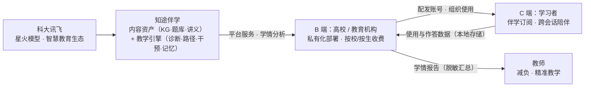

> 草稿，待插入截图与统稿（生成于 2026-09-12）。本卷承接《商业计划书（第 1～3 章）》，为第 7～11 章、参考文献与附录；第 4～6 章（实现与测试）另行撰写。正文中所有金额、用户规模数字均为团队情景估算，已逐处标注「估算」，不构成任何市场承诺；团队与对接信息未定项以「（成员信息待补：XXX）」「（对接记录待补：XXX）」占位，待统稿时补入。

# 商业计划书（第 7～11 章 · 参考文献 · 附录）

**项目名称**：知途伴学——大模型驱动的自适应学习路径决策与伴学智能体

**学校 / 团队**：广东理工学院 · 知途伴学

**赛道**：中国国际大学生创新大赛（2026）产业命题赛道

**命题编号 / 命题企业**：命题九十六 · 科大讯飞

---

# 第七章 竞争优势与创新点

本章回答两个问题：**与谁比**、**凭什么赢**。7.1 节将知途伴学与三类典型技术路线横向对比，7.2 节纵向展开四大创新点。需要先说明本项目的基本定位：不与大厂比拼模型规模，不与学术系统比拼前沿算法，而是以「**可解释、零成本、可私有化**」为差异化轴心，把教育数据挖掘领域数十年积累的成熟方法（BKT、Elo、ZPD、脚手架）与命题企业的大模型能力，工程化地整合为一套可演示、可验证的完整系统。

## 7.1 竞争对比

对比对象选取教育技术领域的三类典型路线：以协同过滤与知识图谱推荐为代表的**传统推荐系统**、以直接问答为代表的**通用大模型答疑产品**、以 DeepTutor（HKUDS，Agent 原生个性化学习助手，多智能体编排 + 三层记忆架构）为代表的**学术研究系统**。七项对比维度与命题要求的个性化、可解释、主动引导一一对应。

**表 7.1 竞争对比表**

| 对比维度 | 传统推荐系统（协同过滤 / 知识图谱推荐） | 通用大模型答疑（直接问答） | DeepTutor 等学术系统 | 知途伴学（本项目） |
| --- | --- | --- | --- | --- |
| 掌握度建模 | 隐式建模：以行为相似度或图谱相关性代替"掌握度"，无显式学情概念 | 无掌握度概念，回答与学生水平无关 | 有统一学习者画像与知识掌握估计，但估计过程不输出公式依据 | 显式公式 θ' = θ + K(c − p)（BKT 简化 + Elo 自适应学习率），每次更新可溯源、可复核 |
| 路径规划 | 按相似度/最短路径推荐，缺乏教育学约束，"为何先学它"说不清 | 无路径规划能力 | 基于画像的个性化学习路径设计，依赖多智能体编排，架构重、难私有化 | 拓扑分层保先修 + ZPD 难度带 + 节奏参数，每步推荐输出可解释理由 |
| 干预方式 | 推送题目与资源列表，无对话式引导 | 问什么答什么，直接给答案，削弱独立思考 | 智能体教学对话、引导式设计，依赖大模型在线推理 | L0~L3 四级脚手架（反问→提示→样例→解析），只引导不代答，末了变式检验闭环 |
| 记忆机制 | 仅行为日志（点击/作答记录），无反思、无跨会话叙事 | 会话结束即失忆；即便挂载外部记忆也只是检索拼接 | 三层记忆架构（摘要/画像/交互轨迹）完整，但依赖向量库等重组件 | SQLite 7 表 + 会话反思摘要 + 跨会话开场白，单文件、零运维 |
| 离线可用性 | 依赖服务端与训练好的模型，通常需联网 | 必须联网调用 API，断网不可用 | 需 LLM API 与外部服务，离线不可运行 | 无 API Key 时 MockLLM 兜底，100% 离线全功能运行，断网可完整演示 |
| 可解释性 | 黑盒：推荐理由不可解释，师生难以信任与修正 | 生成过程黑盒，且存在幻觉风险 | 画像与教学策略部分透明，掌握度估计与路径决策仍为黑盒 | 全链路白盒：掌握度公式、ZPD 带、脚手架层级、路径理由全部显式输出 |
| 部署成本 | 需模型训练与推荐服务运维，中等偏高 | 按 token 计费，边际成本随用量线性增长 | 多智能体 + 向量库 + 大模型，部署与运维门槛高 | 运行依赖仅 7 个开源库，单机零成本运行，可私有化部署，数据不出校 |

**差异化结论**：传统推荐系统缺教育逻辑，通用答疑缺个性化与引导，学术系统全面但重而难落地。知途伴学的差异化不在于任何单项指标"超过谁"，而在于把三者互补的价值——**个性化（学得会）、引导性（教得对）、可解释（信得过）、零成本（用得起）**——以最轻的工程形态装进一台普通电脑。这一组合恰好对应命题"从被动答疑到主动引导"的范式要求：个性化是前提，引导是手段，可解释是信任基础，零成本是落地条件。

## 7.2 四大创新点

### 7.2.1 创新点一：可解释掌握度模型——让"学得怎么样"有公式可依

掌握度模型是全部决策的底座，本项目选择"显式公式"而非"深度学习黑盒"，核心公式为：

> **θ' = θ + K·(c − p)**，其中 c 为答题实际表现（答对为 1、答错为 0），p 为模型对当前表现的概率预测（经 sigmoid 映射），K 为学习率。

该公式融合两条成熟学术路线：**BKT（贝叶斯知识追踪）简化**——用"答题证据"更新掌握概率，符合教育学直觉；**Elo 自适应学习率**——学习率 K 随答题次数衰减，早期快速修正初判、后期稳定收敛，避免一次发挥失常过度改写画像。在此基础上还实现三项细化机制：答对后向后继知识点**传播 +0.05**（学了梯度下降，微积分基础自然更牢）、答错时回标先修知识点 **−0.03**（提示"卡在反向传播，先补链式法则"）、跨会话**遗忘衰减** exp(−0.02·Δt 天)（两个月没复习，掌握度如实回落）。

创新价值在于**可解释性**：每一次掌握度变化的"为什么"都写在公式里——教师可以复核"这个 0.73 是怎么来的"，学生可以看懂"为什么我该复习它"，评委可以现场验证"公式与代码是否一致"。全部更新逻辑可离线单元测试回归（56 个用例全部通过，测试细节见第六章），不依赖任何训练数据即可保证行为正确。

### 7.2.2 创新点二：ZPD 最近发展区路径规划——千人千面，且理由可讲

路径规划采用三维决策，每一步都有明确的教育学依据：

1. **拓扑分层**——按 50 节点、81 条先修关系的知识图谱做拓扑排序，保证"先学梯度下降、再学反向传播"的先后次序不被打破；
2. **ZPD 难度带**——把维果茨基"最近发展区"量化为难度带 [mean(θ), min(mean + 0.15 + 0.35σ, 0.95)]，带内知识点"主修"（跳一跳够得着）、带下知识点"复习"（补先修短板）、带上知识点"暂缓"（太难会挫败）；
3. **节奏参数**——以答题准确率与卡住次数调节推进速度，学得稳则快进、频繁卡壳则放缓并回补。

候选知识点评分 = 0.30·ZPD 适配 + 0.25·(1 − θ) + 0.20·图谱中心性 + 0.15·目标相似度 + 0.10·认知契合，权重公开、结果可复算。同一份图谱与题库，不同学生走出不同路径；画像每更新一次，路径随之重规划。创新价值在于**千人千面与可解释兼得**：路径因人而异，但"为什么是他学这个"永远有据可查、可被教师修正。

### 7.2.3 创新点三：四级脚手架干预——引导式教学的产品化实现

当学生在问答或测验中卡住时，系统不直接给答案，而是按四级阶梯逐级升级支撑：

- **L0 苏格拉底反问**：不提供任何信息，用问题引导学生自己发现关键线索（"如果不做标准化，权重大的特征会怎样？"）；
- **L1 概念提示**：提示相关概念的定义或位置，点到为止；
- **L2 类比样例**：给出同构的类比或相似例题，让学生迁移方法；
- **L3 分步解析**：分步拆解思路（仍不给完整答案），并在学生作答后**变式检验**——换一道同知识点变式题确认"真学会"而非"记住答案"；变式仍错则触发路径重规划，回补先修知识点。

创新价值有三：其一，**教育学正确性**——苏格拉底式引导是学界公认的培养独立解题能力的路径，本项目将其从理念落地为可测试的规则；其二，**防幻觉锚定**——干预内容以题库内置提示为锚（150 题，每题含 L0~L3 四级提示）与讲义原文为据，大模型只做语言组织、不做知识发明，从机制上压制大模型幻觉；其三，**闭环检验**——变式检验把"教学动作"与"学习效果"挂钩，干预是否有效有数据可查。

### 7.2.4 创新点四：离线双模式架构——零成本可演示、一键接星火

LLM 层采用**双通道设计**：每条消息同时携带结构化标记（模板路由键）与原始素材（讲义原文、题干），MockLLM 按路由键生成确定性的强引导输出，真实大模型按 OpenAI 兼容接口处理同一素材——**Mock 模式与真实模式共用同一接口契约**。

由此获得三个工程特性：

- **无 Key 全功能**：未配置任何 API Key 时系统自动降级 Mock 离线模式，诊断、路径、教学、干预、记忆全部功能 100% 可用，开发、演示、交付全程不中断；
- **断网可演示**：答辩现场、评审教室断网也不影响任何环节，演示确定性高（Mock 输出可预期，不依赖网络波动）；
- **换 Key 即接命题企业模型**：在配置中写入星火 base_url（spark-api-open.xf-yun.com）与 Key 即可切换真实星火大模型，DeepSeek、Qwen、GLM 等 OpenAI 兼容服务同理，接口契约一致、一行配置完成切换。

创新价值在于**把"低成本"做成竞争力**：对学生团队意味着零预算完成开发与演示；对学校意味着私有化部署、数据不出校；对命题企业意味着"演示即接入"——系统交付时已是星火生态的可运行组件。

---

# 第八章 商业模式与科大讯飞合作模式

## 8.1 B2B2C 商业模式

知途伴学以「**内容资产 + 教学引擎**」为核心，采用 B2B2C 模式：面向高校与教育机构（B 端）提供教学平台与学情分析服务，机构采购后带动学生（C 端）使用伴学服务，C 端订阅与使用数据反哺内容与引擎迭代。教师既是 B 端决策链上的影响者，也是产品的直接使用者。

- **B 端（高校 / 教育机构）**：私有化部署与运维、课程知识图谱定制（换课程不换架构）、班级学情分析报告、教师使用培训；
- **C 端（学习者）**：伴学智能体订阅——诊断、路径、引导、记忆四能力一体，随时开始、跨会话延续；
- **目标客户画像**：商业模式视角下，B 端决策方（教务处、学院、机构负责人）的核心关切是**数据不出校、决策可解释、部署零负担**；C 端使用者的核心关切是**路径合理、引导到位、记得住我**。用户群体分类与优先级详见 2.4 节，此处不赘述。

**图 8.1 B2B2C 商业模式示意**

## 8.2 轻量成本结构

本项目的成本结构刻意做到"最轻"，如实测算如下：

**表 8.1 成本结构表（金额为估算）**

| 成本项 | 构成 | 量级（估算） | 说明 |
| --- | --- | --- | --- |
| 开发成本 | 团队人力 | 以机会成本计（学生团队以赛代练，无外包支出） | 系统开发期间未产生任何软件采购费用 |
| 软件授权 | 技术栈授权 | 0 元 | 全部为免费开源组件：Python / Streamlit / SQLite，运行依赖仅 7 个开源库（streamlit、plotly、networkx、jieba、pyyaml、openai 兼容层、pytest） |
| 基础设施 | 服务器 / GPU | 0 元（开发与试点期） | 单机本地运行，无云服务器、无 GPU、无图数据库 |
| 运营成本（模型） | 大模型 API 调用费 | 小规模试点下**近零边际成本** | 星火 lite 提供永久免费额度；Pro 对个人开发者提供月度免费 tokens（以讯飞开放平台实时政策为准，团队调研记录见 8.6） |
| 运营成本（数据） | 数据存储 | 近零 | SQLite 本地单文件存储，无云存储费用 |
| 运营成本（推广） | 试点运营与内容维护 | 以机会成本计（估算） | 课程内容更新、试点校驻场支持 |

两点如实说明：其一，**开发成本 = 人工 + 免费开源技术栈**，这是学生团队以"零预算出完整系统"的前提；其二，运营成本的最大变量是**大模型 API 调用费**，在星火免费额度覆盖下小规模试点运营边际成本接近零，规模扩大后转为按量付费、成本随用量线性增长，但仍显著低于自建 GPU 推理或采购商业题库的成本。免费额度政策存在调整可能（如星火 Max 套餐已于 2026-03 下线），团队已按"多引擎可替换"设计对冲（见 8.4）。

## 8.3 营收预估（三档情景，全部为估算）

营收设计为三种收费形态，与 B2B2C 结构一一对应：

1. **高校年度服务费**：私有化部署 + 学情分析报告 + 课程知识图谱定制，**0.5 万～3 万元/校·年（估算）**；
2. **机构按学生数订阅**：教育机构按注册学生数采购伴学服务，**20～50 元/生·学期（估算）**；
3. **学习者订阅**：个人用户订阅伴学服务，**88～199 元/人·年，或 9.9～19.9 元/月（估算）**。

**表 8.2 三档情景营收测算（估算，仅用于验证商业模式可行性，不构成预测或承诺）**

| 情景 | 关键假设（估算） | 年收入区间（估算） |
| --- | --- | --- |
| 保守（第 1～2 年） | 高校试点 5 校 × 0.5 万～1 万元；机构 1 家 × 1000 生 × 20～30 元；个人订阅 500 人 × 88 元 | 约 9 万～13 万元/年 |
| 中性（第 2～3 年） | 高校 20 校 × 1 万～1.5 万元；机构 5 家 × 共 5000 生 × 30～40 元；个人订阅 3000 人 × 99～129 元 | 约 65 万～89 万元/年 |
| 乐观（第 3～5 年） | 高校 50 校 × 2 万～3 万元；机构 20 家 × 共 2 万生 × 40～50 元；个人订阅 1 万人 × 129～199 元 | 约 310 万～450 万元/年 |

三点审慎说明：**其一**，以上数字全部为团队自行设定的情景假设，用于测算商业模式的成立条件，不包含任何市场承诺成分，市场容量与用户基数数据见第二章；**其二**，第一阶段（1～2 年）以**免费试点**为主——用免费部署换取课堂实测数据与教学效果案例，收入主要来自少量 B 端试点服务费，此时运营成本由星火免费额度覆盖，现金流压力小；**其三**，定价参照教育信息化服务与学习类订阅的常见区间设定下限，实际定价将依据试点校反馈调整。

## 8.4 风险与对策

**表 8.3 风险与对策表**

| 风险类别 | 具体风险 | 对策 |
| --- | --- | --- |
| 技术风险 | 大模型幻觉：编造知识点、给出错误解析，损害教学可信度 | 题库 hints 锚定 + 讲义原文注入：干预与讲解以自建题库（150 题 × L0~L3 四级提示）与讲义原文为唯一知识来源，大模型只做语言组织、不做知识发明；无 Key 时 Mock 兜底保证底线质量 |
| 数据风险 | 学情隐私：学生画像、作答轨迹、对话记录均为敏感教育数据 | 本地 SQLite + 最小化采集：全部数据存储在部署方本地单文件数据库，数据不出校；仅采集与学习诊断直接相关的最小字段，不收集无关个人信息 |
| 商业风险 | 竞争挤压：头部厂商及命题企业自有产品（AI 学习机、智学网等）覆盖面广 | 讯飞生态互补定位：不与既有产品正面竞争，聚焦其相对薄弱的大学段与"可私有化轻量组件"位置（见 8.5），做生态补位者而非替代者 |
| 依赖风险 | 模型 API 成本上浮或免费政策调整，抬高运营成本 | Mock 兜底 + 多引擎兼容：无 Key 时全功能离线可跑；OpenAI 兼容抽象层一行配置切换 DeepSeek / Qwen / GLM 等，不锁定单一供应商，供应商政策变动不构成单点故障 |

## 8.5 与科大讯飞合作模式

团队以「产业命题赛道揭榜者」的身份规划与讯飞的合作，提出技术、内容、渠道、生态四条路径，由浅入深、层层递进：

**表 8.4 与科大讯飞合作路径**

| 路径 | 层面 | 合作内容 | 现状 |
| --- | --- | --- | --- |
| 路径一：接入星火大模型 | 技术层 | 系统以星火为优先推荐的大模型引擎，配置即接入（OpenAI 兼容端点 spark-api-open.xf-yun.com/v1）；利用 lite 永久免费额度支撑开发、演示与初阶运营 | **已完成接口预研**（2026-09-12） |
| 路径二：共建学科知识图谱与题库 | 内容层 | 以本项目 50 节点《机器学习》知识图谱与 150 题题库（解析 + 四级提示 + 变式题）为起点，联合扩展更多学科与课程，探索纳入讯飞因材施教内容体系 | 规划中 |
| 路径三：智学网 / 高校智慧教育场景试点 | 渠道层 | 据团队调研（2026-09），讯飞智慧教育以 K12 为主、大学段相对薄弱，智学网亦未覆盖高校——本项目面向高校《机器学习》课堂的可私有化轻量组件，恰可补位其大学段生态增量场景 | 规划中 |
| 路径四：讯飞开放平台开发者生态 | 生态层 | 依托讯飞开放平台与星辰 MaaS 工具链持续迭代；对标「星火杯」教育智能体赛事与讯飞高校共建范式（产业学院、联合实验室），形成长期人才与内容供给 | 规划中 |

**表 8.5 双向资源清单**

| 我们为讯飞带来 | 讯飞为我们带来 |
| --- | --- |
| 面向高校场景、可运行的四能力闭环伴学原型（诊断 / 路径 / 干预 / 记忆），零成本、可私有化 | 星火大模型 API 与免费额度政策（lite 永久免费、Pro 月度免费 tokens，以官方实时政策为准） |
| 可解释教学决策模型（BKT+Elo、ZPD 带、四级脚手架），回应讯飞"从解题到伴学"的战略升级方向 | 智慧教育生态渠道：智学网、AI 学习机、智慧课堂、因材施教解决方案 |
| 50 知识点知识图谱、150 题题库、分段讲义等内容资产 | 行业品牌与命题背书、产教融合专家资源 |
| 大学段生态补位价值：高校《机器学习》课堂验证场景与在校师生试点资源 | 高校合作范式参考（产业学院、联合实验室、智慧校园基座等，2024—2026 公开案例） |
| 轻量"教育大模型 + 知识图谱"工程化样本，愿意开源共建 | 开发者生态资源：讯飞开放平台、星辰 MaaS、星火杯赛事通道 |
| 年轻开发者团队与开源社区传播意愿 | 国产自主可控教育大模型的叙事与展示平台 |

## 8.6 对接工作开展情况

**表 8.6 对接工作进展表**

| 序号 | 事项 | 状态 | 说明 |
| --- | --- | --- | --- |
| 1 | 命题解读与需求对齐 | **已完成** | 对照命题四大能力完成应答映射（见表 2.1）；完成学术与开源路线调研（DeepTutor / EduChat / d2l-zh）与竞品分析 |
| 2 | 讯飞开放平台与星火 API 技术调研 | **已完成**（2026-09-12） | 确认 OpenAI 兼容端点与鉴权方式、模型参数（lite 等）与免费额度政策（星火 lite 永久免费额度）；梳理智学网、智慧教育生态与高校合作案例 |
| 3 | 系统完成与双模式接口设计 | **已完成** | 全系统 56 个 pytest 用例全部通过；无 API Key 时 100% 离线运行；OpenAI 兼容层"换 Key 即接星火"，接口契约一致 |
| 4 | 星火 API 额度申请与实名认证状态 | 进行中 | （对接记录待补：XXX——额度申请进度、可用模型与 tokens 余量） |
| 5 | 智学网共建交流 | 待启动 | （对接记录待补：XXX——交流对象、时间与议题） |
| 6 | 讯飞专家 / 产教融合团队沟通记录 | 待启动 | （对接记录待补：XXX——沟通对象与结论） |

后续动作按大赛时间表推进：**2026-09-15 提交项目书**后，通过产业命题赛道对接渠道与讯飞产教融合团队建立联系，并依托「星火杯」等公开赛事通道持续申请讯飞官方资源扶持（如星辰 MaaS 调用额度），使合作从"接口预研"走向"真实调用、真实试点"。

---

# 第九章 社会价值与应用场景

## 9.1 社会价值

**（1）教育公平：让个性化学习不再是稀缺资源。** 系统单机零成本运行——无需 GPU、无需付费 API、断网可用，一台普通电脑即可部署。"千人千面"的个性化路径与引导式辅导，由此可以走进欠发达地区、乡村学校与经费紧张的院系，让学习起点不同的学生获得同等质量的"一对一"引导。

**（2）教师减负：把教师从重复劳动中释放出来。** 系统承接大量重复性答疑、基础诊断与巩固训练，教师从"一人对百人"的逐题解答中解脱，聚焦高阶指导与教学设计；班级学情分析报告让教师批量掌握全班掌握度分布与共性卡点，备课与讲评有的放矢。

**（3）可解释学情：学生、教师、家长三方共读一份可信报告。** 掌握度由显式公式更新、路径带教育学理由、干预按规则分级——学生看懂"我为什么学这个"，教师看懂"系统为什么这样判断"，家长看懂"孩子卡在哪里"。教育场景中，可解释才可信任、可信任才可交付，这是本项目对"黑盒 AI 进课堂"担忧的正面回应。

**（4）AI 素养教育示范：用 AI 学知识，也看懂 AI 本身。** 学生不仅使用 AI 学习，还能直接看见它的决策逻辑——公式、规则、状态机全部白盒呈现，理解"大模型 + 显式规则"混合架构的能力边界与局限（如大模型为何需要题库锚定防幻觉）。这一设计本身即是一堂关于 AI 能力与伦理的素养课，与高校人工智能通识教育方向一致。

## 9.2 应用场景

**场景一：高校课堂助教。** 任课教师为所授《机器学习》课程部署本系统，课后诊断、答疑分流、随堂测验与巩固训练全部自动完成。教师端查看班级学情概览，针对性调整授课重点；学生端获得随叫随到、记得住自己的课程助教。

**场景二：学生课后自学。** 学生课下随时开始会话，系统以"接着上次"的开场白延续进度，按 ZPD 路径推进教学；卡住时四级脚手架逐级引导，答对后变式检验巩固。期末备考时，画像仪表盘一键定位薄弱知识点，复习有的放矢。

**场景三：教育机构伴学服务。** 培训机构为学员配发伴学账号，按学生数订阅；机构教师依据学情报告安排一对一辅导时段，把有限师资用在最需要的学员身上。伴学智能体承担"平时陪伴"，真人教师承担"关键点拨"，各司其职。

**场景四：乡村与边远地区自适应学习。** 在网络不稳定、经费有限的学校，以离线单机部署本系统，学生即可获得与发达地区同等质量的个性化学习路径与引导式辅导。数据全部本地存储，不依赖网络与外部服务，一次部署长期可用。

---

# 第十章 未来展望

以下展望基于现有原型的实际能力边界制定，按"可行性优先"排序，不空谈愿景。

## 10.1 多学科扩展：知识图谱数据驱动

现有 JSON 知识图谱支持热替换，四大引擎（诊断、路径、干预、记忆）零改动即可迁移到新课程。下一步以「大模型辅助构建 + 学科教师人工审核」的方式生成新学科图谱与题库，优先扩展《深度学习》《概率统计》等与机器学习强相关的课程，以"一门课接着一门课"验证可复制性。

## 10.2 多模态交互

探索语音问答与朗读（可依托讯飞开放平台的语音识别与合成能力）、公式与手写体识别、图文并茂的讲义讲解，让伴学体验从"打字对话"走向"像真人教师一样听说读写"。多模态能力按独立模块增量接入，不改变现有架构。

## 10.3 规模化部署：服务化与多租户

从单机走向服务化：后端 API 化（Streamlit 界面与引擎解耦）、多租户隔离（按校、按班划分独立数据空间）、与校园平台统一身份认证对接。在此过程中保持"可私有化"底线——服务化部署与单机部署共用同一套引擎代码。

## 10.4 与讯飞生态深度融合

生产级接入星火大模型，争取智学网与高校智慧教育场景的试点机会，让本系统成为讯飞大学段生态的可私有化轻量组件；远期探索与 AI 学习机、因材施教解决方案的内容与数据联动。以上均为规划方向，以双方实际对接进展为准。

## 10.5 开放共建社区

开源知识图谱与题库的格式规范及构建工具，邀请高校师生共建课程内容，以社区评审保证教学正确性；以本项目为案例，沉淀"大模型 + 可解释小模型"的轻量教育智能体开发范式，让更多高校团队以零成本复现与改进。

---

# 第十一章 总结与致谢

## 11.1 总结

知途伴学从科大讯飞命题九十六《大模型驱动的自适应学习路径决策与伴学智能体开发》出发，以"教育学正确性优先、可解释性优先、可私有化部署优先"为工程原则，将命题要求的四大能力逐一落地为可运行、可验证的系统模块：

**表 11.1 命题四大能力与交付物对照表**

| 命题能力 | 系统实现 | 核心交付物 |
| --- | --- | --- |
| 学情诊断 | 对话 + 测验双通道诊断，掌握度模型 θ' = θ + K(c − p)（BKT 简化 + Elo 自适应学习率），学生画像仪表盘 | 掌握度模型与诊断引擎 |
| 路径规划 | 拓扑分层 + ZPD 难度带 + 节奏参数，动态重规划 | 路径规划引擎（50 节点 · 81 先修关系知识图谱可视化） |
| 实时干预 | L0~L3 四级脚手架 + 变式检验闭环，题库 hints 锚定防幻觉 | 干预引擎（150 题题库：每题解析 + L0~L3 四级提示 + 变式题） |
| 记忆与反思 | SQLite 7 表记忆库 + 会话反思摘要 + 跨会话开场白延续 | 记忆反思引擎 |
| 工程底座 | 离线双模式（MockLLM 兜底 / OpenAI 兼容切换星火等） | 56 个 pytest 用例全部通过；运行依赖仅 7 个开源库；无 Key 100% 离线可运行 |

需要坦诚的是：本系统仍是原型阶段，其教学效果尚需课堂实测数据的检验；知识图谱规模、题库数量与真实教学需求之间也仍有距离。团队将把评审意见与试点反馈作为下一步迭代的第一输入，持续打磨"既懂知识、又懂学生、还能持续陪伴"的 AI 导师。

## 11.2 致谢

感谢**科大讯飞**以产业命题的方式为大学生团队提供真实场景与星火大模型开放能力，感谢**中国国际大学生创新大赛组委会**搭建的揭榜平台，感谢命题解读与评审过程中的指导与反馈；感谢**广东理工学院**的培养与支持，感谢指导教师（成员信息待补：XXX）在方向与方法上的悉心指导；感谢团队每一位成员的投入，以及开发过程中所有开源项目作者（DeepTutor、d2l-zh、EduChat 等）的无私分享。

## 11.3 团队成员表（信息待补）

| 姓名 | 分工 | 主要贡献 |
| --- | --- | --- |
| （成员信息待补：XXX） | 队长 / 算法 | 掌握度模型与路径规划引擎 |
| （成员信息待补：XXX） | 工程 | 智能体编排、状态机与记忆库 |
| （成员信息待补：XXX） | 内容 | 知识图谱、题库与讲义构建 |
| （成员信息待补：XXX） | 测试 / 文档 | 测试体系、项目书与演示材料 |

> 上表分工为占位描述，最终以实际名单与贡献为准。

---

# 参考文献（知识来源）

> 说明：本项目的知识库内容、算法设计与商业判断均以下列公开文献、开源项目与官方资料为依据，分四类编号列出。

## ① 知识库内容依据

- **R1** 周志华. 机器学习[M]. 北京：清华大学出版社.
- **R2** 李航. 统计学习方法（第 2 版）[M]. 北京：清华大学出版社.
- **R3** d2l-ai/d2l-zh（动手学深度学习中文版）. GitHub 仓库：<https://github.com/d2l-ai/d2l-zh>
- **R4** 吴恩达（Andrew Ng）. Machine Learning 课程. Coursera.
- **R5** James G., Witten D., Hastie T., Tibshirani R. An Introduction to Statistical Learning (ISLR). Springer.

## ② 开源项目借鉴

- **R6** HKUDS/DeepTutor（Agent 原生个性化学习助手，Apache-2.0）. GitHub 仓库：<https://github.com/HKUDS/DeepTutor>
- **R7** d2l-ai/d2l-zh（Apache-2.0）. GitHub 仓库：<https://github.com/d2l-ai/d2l-zh>
- **R8** ECNU-ICALK/EduChat（华东师范大学教育大模型）. GitHub 仓库：<https://github.com/ECNU-ICALK/EduChat>

## ③ 学术论文

- **R9** LOOM: Dynamic Learner Memory Graphs（动态学习者记忆图谱）. arXiv:2511.21037, AAAI 2026 PerFM Workshop.
- **R10** Knowledge Tracing Meets Large Language Models: A Systematic Review. arXiv:2412.09248.
- **R11** Scarlatos et al. LLMKT（LLM-based Knowledge Tracing, 基于大模型的知识追踪）. 2025.
- **R12** Hooshyar et al. 混合知识追踪框架. 2025.
- **R13** Corbett A. T., Anderson J. R. Knowledge Tracing: Modeling the Acquisition of Procedural Knowledge. User Modeling and User-Adapted Interaction, 1995.

## ④ 命题与行业资料

- **R14** 中国国际大学生创新大赛（2026）产业命题赛道命题九十六《大模型驱动的自适应学习路径决策与伴学智能体开发》命题原文（命题企业：科大讯飞）.
- **R15** 科大讯飞开放平台与星火大模型公开资料（API 文档、免费额度政策、智慧教育产品介绍）. <https://www.xfyun.cn> 与讯飞开放平台官网，访问日期：2026-09.

---

# 附录 A 机器学习知识图谱 50 知识点清单

> 数据与系统 `data/kg/` 一致；难度为 0～1 归一化值（越高越难）。共 50 节点：数学基础 8、ML 概论 4、经典监督学习 12、集成学习 5、神经网络深度学习 12、评估调优 6、无监督学习 3。

**表 A.1 50 知识点清单**

| ID | 知识点 | 类别 | 难度 |
| --- | --- | --- | --- |
| m01 | 线性代数与向量空间 | 数学基础 | 0.25 |
| m02 | 矩阵运算与特征分解 | 数学基础 | 0.3 |
| m03 | 微积分与梯度 | 数学基础 | 0.3 |
| m04 | 概率论基础 | 数学基础 | 0.3 |
| m05 | 统计推断与参数估计 | 数学基础 | 0.35 |
| m06 | 信息论基础：熵与交叉熵 | 数学基础 | 0.4 |
| m07 | 数值优化与梯度下降 | 数学基础 | 0.4 |
| m08 | 凸优化基础 | 数学基础 | 0.5 |
| b01 | 机器学习基本概念 | ML概论 | 0.25 |
| b02 | 经验风险与损失函数 | ML概论 | 0.35 |
| b03 | 过拟合、正则化与偏差方差权衡 | ML概论 | 0.4 |
| b04 | 模型评估与验证方法 | ML概论 | 0.4 |
| s01 | K近邻 | 经典监督学习 | 0.3 |
| s02 | 线性回归 | 经典监督学习 | 0.35 |
| s03 | 逻辑回归 | 经典监督学习 | 0.45 |
| s04 | 朴素贝叶斯 | 经典监督学习 | 0.4 |
| s05 | 决策树 | 经典监督学习 | 0.45 |
| s06 | 感知机与线性可分性 | 经典监督学习 | 0.35 |
| s07 | 支持向量机与核方法 | 经典监督学习 | 0.55 |
| s08 | 线性判别分析 | 经典监督学习 | 0.45 |
| s09 | 岭回归与LASSO | 经典监督学习 | 0.5 |
| s10 | 特征工程与特征选择 | 经典监督学习 | 0.4 |
| s11 | 广义线性模型与Softmax回归 | 经典监督学习 | 0.55 |
| s12 | 贝叶斯学习视角：MLE与MAP | 经典监督学习 | 0.55 |
| e01 | 集成学习思想与偏差方差视角 | 集成学习 | 0.45 |
| e02 | Bagging与随机森林 | 集成学习 | 0.5 |
| e03 | Boosting与AdaBoost | 集成学习 | 0.55 |
| e04 | GBDT与XGBoost | 集成学习 | 0.6 |
| e05 | Stacking与集成策略 | 集成学习 | 0.55 |
| d01 | 多层感知机MLP | 神经网络深度学习 | 0.45 |
| d02 | 反向传播算法 | 神经网络深度学习 | 0.55 |
| d03 | 激活函数与梯度消失爆炸 | 神经网络深度学习 | 0.5 |
| d04 | 优化器进阶：动量与Adam | 神经网络深度学习 | 0.55 |
| d05 | 权重初始化与BatchNorm | 神经网络深度学习 | 0.55 |
| d06 | 卷积神经网络CNN | 神经网络深度学习 | 0.6 |
| d07 | 循环神经网络与LSTM | 神经网络深度学习 | 0.6 |
| d08 | Transformer与自注意力 | 神经网络深度学习 | 0.65 |
| d09 | 词嵌入与表示学习 | 神经网络深度学习 | 0.55 |
| d10 | 生成对抗网络初步 | 神经网络深度学习 | 0.65 |
| d11 | 大模型与预训练-微调范式 | 神经网络深度学习 | 0.6 |
| d12 | 深度学习正则化：Dropout等 | 神经网络深度学习 | 0.5 |
| v01 | 性能度量：精确率召回率F1与AUC | 评估调优 | 0.4 |
| v02 | 超参数调优 | 评估调优 | 0.45 |
| v03 | 交叉验证与模型选择 | 评估调优 | 0.45 |
| v04 | 模型可解释性 | 评估调优 | 0.5 |
| v05 | 模型部署与工程化初步 | 评估调优 | 0.5 |
| v06 | 实验设计与多模型比较 | 评估调优 | 0.5 |
| u01 | K-means聚类 | 无监督学习 | 0.45 |
| u02 | 层次聚类与DBSCAN | 无监督学习 | 0.5 |
| u03 | 主成分分析PCA | 无监督学习 | 0.5 |

---

# 附录 B 借鉴—改进对照详表

**表 B.1 借鉴—改进对照详表**

| 来源 | 借鉴内容 | 本项目改进 |
| --- | --- | --- |
| DeepTutor（HKUDS，Apache-2.0） | 掌握度路径规划与三层记忆架构（摘要/画像/交互轨迹） | 轻量 SQLite 单文件实现记忆架构；掌握度写成显式可解释公式 θ' = θ + K(c − p)；路径叠加 ZPD 难度带与节奏参数 |
| d2l-zh（Apache-2.0） | 由浅入深的知识编排与课程组织 | 讲义结构化：分段讲义内嵌 [ASK:] 提问位，把静态教材改造为系统主动提问的交互载体 |
| EduChat（ECNU-ICALK） | 苏格拉底式引导教学、先思考后教学 | 引导过程显式化为 L0~L3 四级阶梯（反问→提示→样例→解析）；以题库 hints 锚定防幻觉；变式检验闭环确认"真学会" |
| LOOM 动态学习者记忆图谱（arXiv:2511.21037） | 动态学习者记忆图谱思想 | 以离线快照 + 会话反思摘要轻量实现跨会话记忆，免向量库、免外部服务 |
| KT×LLM 综述等知识追踪文献（arXiv:2412.09248 等） | 大模型时代知识追踪的方法脉络 | 综合为先修传播（+0.05 后继 / −0.03 先修）+ 遗忘衰减 exp(−0.02·Δt) + 软证据混合更新的显式规则模型 |

---

# 附录 C 演示视频分镜脚本（3～5 分钟）

> 视频按 12 个分镜覆盖 8 幕剧本：痛点开场 → 登录诊断 → 测验 → 路径 → 教学 → 卡住干预 → 反思 → 重登记忆 → 技术亮点 → 片尾。画面以系统实拍为主，字幕配合旁白。

**表 C.1 演示视频分镜脚本**

| 分镜号 | 时间 | 画面 | 讲解要点 |
| --- | --- | --- | --- |
| 1 | 00:00–00:25 | 痛点开场 | 字幕 + 旁白：大模型教育产品四大痛点（千篇一律 / 直接给答案 / 对话即失忆 / 路径黑盒）；切入命题九十六《大模型驱动的自适应学习路径决策与伴学智能体开发》（科大讯飞） | 抛出问题，点明命题来源与团队定位 |
| 2 | 00:25–00:50 | 登录 · 跨会话开场白 | 学生登录；开场白"接着上次"引用上次学习记忆与未解之惑；右侧信息卡显示相位、当前知识点、掌握度、讲义进度 | 记忆延续是"持续陪伴"的第一步 |
| 3 | 00:50–01:10 | 诊断 | 进入 DIAGNOSING：对话式提问了解基础与目标，快速诊断提问；学生画像仪表盘逐步成形 | 先懂学生、再谈教学 |
| 4 | 01:10–01:35 | 测验 | 自适应测验：答对沿主链上跳、答错下钻先修；画面特写掌握度更新公式 θ' = θ + K(c − p) 与数值变化 | 每个数字都有公式依据，可解释 |
| 5 | 01:35–02:00 | 路径 | 知识图谱页：50 节点按掌握状态着色，ZPD 带内推荐路径高亮，逐条显示推荐理由与难度带 | 拓扑保先修、ZPD 匹配难度、节奏适配速度 |
| 6 | 02:00–02:25 | 教学 | TEACHING 分段讲义推进，[ASK:] 提问位触发系统主动提问，学生作答 | 主动引导而非被动答疑 |
| 7 | 02:25–02:50 | 卡住干预（L0→L1） | 学生卡壳：系统先 L0 苏格拉底反问；仍不会升 L1 概念提示；信息卡实时显示脚手架层级 | 只引导不代答，逐级给支撑 |
| 8 | 02:50–03:15 | 干预升级与变式检验 | L2 类比样例 → L3 分步解析（内容锚定题库 hints）；答出后立即出变式题检验；变式仍错则路径重规划回补先修 | 防幻觉锚定 + 变式检验闭环，确认真学会 |
| 9 | 03:15–03:35 | 会话反思 | 点击"结束"：进入 REFLECTING，生成反思摘要（本次收获 / 薄弱点 / 下次建议）并落库 | 反思让每一次会话都增值 |
| 10 | 03:35–03:55 | 重登记忆 | 重新登录：开场白引用上次反思与进度；展示 SQLite 7 表（学生 / 对话 / 测验 / 掌握度 / 路径 / 干预 / 反思） | 单文件数据库承载长期记忆 |
| 11 | 03:55–04:20 | 技术亮点 · 离线双模式 | 断网环境下走完 Mock 模式全流程；再演示写入 config 中星火 base_url + Key 后切换真实星火 | 无 Key 100% 离线、换 Key 即接星火、56 用例保障质量 |
| 12 | 04:20–04:30 | 片尾 | 项目名、学校团队、命题九十六 · 科大讯飞、致谢（指导教师信息待补） | 一句话总结：既懂知识、又懂学生、还能持续陪伴 |

---

# 附录 D 术语表

**表 D.1 术语表**

| 术语 | 说明 |
| --- | --- |
| 知识图谱（KG） | 以节点（知识点）与边（先修关系）组织的课程知识结构，本项目为 50 节点、81 条先修关系的 JSON 图谱 |
| 掌握度 θ | 表示学生对某知识点掌握程度的 0～1 连续值，由答题证据按显式公式实时更新 |
| BKT | 贝叶斯知识追踪，1995 年由 Corbett 与 Anderson 提出，用答题证据更新掌握概率的经典模型 |
| Elo 自适应学习率 | 借鉴 Elo 评级思想，让掌握度更新步长 K 随答题次数衰减，实现"先快后稳"的收敛 |
| ZPD（最近发展区） | 维果茨基提出的教育学概念；本项目量化为难度带 [mean(θ), min(mean + 0.15 + 0.35σ, 0.95)]，带内主修、带下复习、带上暂缓 |
| 脚手架（Scaffolding） | 学生卡住时按层级提供的渐进式支撑；本项目为 L0 反问 → L1 提示 → L2 样例 → L3 解析四级 |
| Socratic 提问 | 苏格拉底式反问：不直接给出答案，用问题引导学生自己发现结论 |
| FSM 状态机 | 有限状态机；本项目以 IDLE / DIAGNOSING / TEACHING / QUIZZING / INTERVENING / REFLECTING 六态组织会话节奏 |
| MockLLM | 离线大模型替身，按结构化标记路由生成确定性强引导输出，保证无 API Key 时全功能运行 |
| WAL | SQLite 预写式日志模式，提升写入并发性能与崩溃恢复能力，本项目数据库默认开启 |
| OpenAI 兼容层 | 统一的大模型调用接口抽象；星火 / DeepSeek / Qwen / GLM 等仅需更换 base_url 与 Key，接口契约一致 |
| 变式检验 | 学生作答或获得解析后给出同知识点变式题，确认"真学会"而非"记住答案" |

---

> 全文完。待补项：正文截图（【图 x.x 截图待插入】见第 1～6 章）、团队成员信息（占位符）、讯飞对接记录（占位符）、指导教师信息（占位符）。
